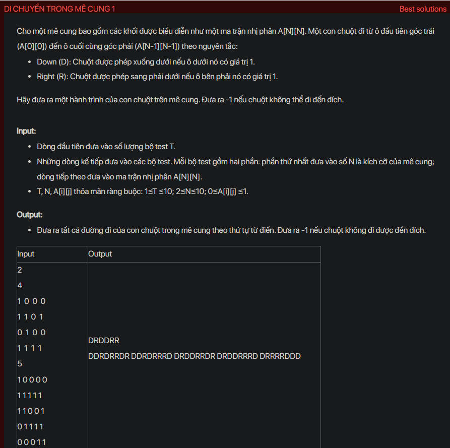

## dsa02003


```cpp
#include <bits/stdc++.h>
using namespace std;
int a[11][11], n;
vector<string>res;
void testCase();
void Try(int i, int j, string s);
int main() {
    // Write your code here
    #ifndef ONLINE_JUDGE
    freopen("input.txt", "r", stdin);
    freopen("output.txt", "w", stdout);
    #endif
    int t;
    cin >> t;
    while (t--) {
        testCase();
        cout << endl;
    }
    return 0;
}
void Try(int i, int j, string s) {
    if (i == n && j == n) {
        res.push_back(s);
        return;
    }
    if (i < n && a[i + 1][j] == 1) {
        Try(i + 1, j , s + 'D');
    }
    if (j < n && a[i][j + 1] == 1) {
        Try(i, j + 1, s + 'R');
    }
}
void testCase() {
    cin >> n;
    res.clear();
    for (int i= 1; i <= n; i++) {
        for (int j= 1 ; j <= n; j++) {
            cin >> a[i][j];
        }
    }
    if (a[1][1] == 0 || a[n][n] == 0) {
        cout << "-1";
        return;
    }
    Try(1, 1 , "");
    if (res.empty()) {
        cout << "-1";
        return;
    }
    sort(res.begin(), res.end());
    for (int i = 0; i < res.size(); i++) {
        cout << res[i] << " ";
    }
}
```