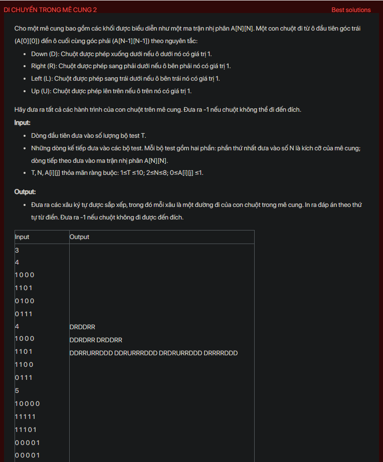

## dsa02004

## Explain
Sure, let's break down the algorithm in a more detailed way:

1. **Initialization:** The algorithm starts by initializing an empty string `s` and an empty vector `res` to store the paths. It also reads the size of the maze `n` and the maze itself from the input.

2. **Checking the start and end points:** If the top-left cell (the start point) or the bottom-right cell (the end point) of the maze is blocked (i.e., its value is 0), the algorithm immediately prints "-1" and returns, because it's impossible to find a path in this case.

3. **Depth-First Search (DFS):** The algorithm then performs a DFS starting from the top-left cell. DFS is a technique for traversing a graph (or in this case, a maze) that goes as deep as possible along each path before backtracking. Here's how the DFS works in this algorithm:

   - **Base case:** If the current cell is the bottom-right cell, the algorithm adds the current path `s` to the vector `res` and returns. This is because it has found a valid path from the top-left to the bottom-right cell.
   
   - **Recursive case:** If the current cell is not the bottom-right cell, the algorithm tries to move to each of the four neighboring cells (down, right, left, up) if the corresponding cell is not blocked (i.e., its value is 1). For each valid move, it appends the corresponding character ('D', 'R', 'L', 'U') to the path `s` and performs a DFS on the new cell. To avoid visiting the same cell multiple times, it marks the current cell as visited by setting its value to 0 before making the recursive calls, and then sets it back to 1 after the recursive calls.

4. **Printing the paths:** After performing the DFS, if the vector `res` is empty, the algorithm prints "-1" and returns, because it has found no path from the top-left to the bottom-right cell. Otherwise, it sorts the paths in `res` in lexicographical order and prints them.

This algorithm essentially explores all possible paths from the top-left to the bottom-right cell of the maze using DFS, and keeps track of the valid paths. It ensures that each cell is visited at most once in each path by marking the visited cells.