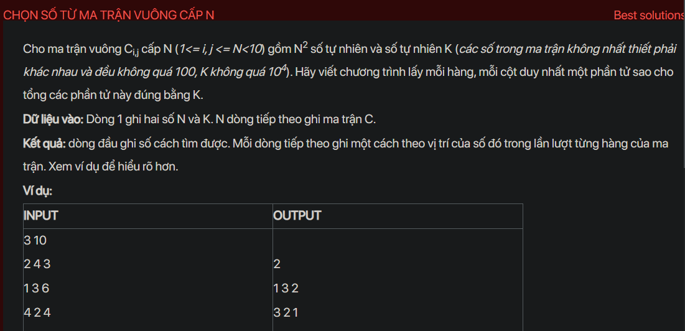

## dsa02008



```cpp
#include <bits/stdc++.h>
using namespace std;
int n, k;
vector<vector<int>>a, res;
vector<int> b;
vector<bool>used;
void testCase();
void reinit();
void Try(int i);
void solve();
int main() {
    // Write your code here
    #ifndef ONLINE_JUDGE
    freopen("input.txt", "r", stdin);
    freopen("output.txt", "w", stdout);
    #endif
    testCase();
    return 0;
}
void Try(int i) {
    for (int j = 0; j < n; j++) {
        if (!used[j]) {
            b[i] = j;
            used[j] = true;
            if (i == n - 1) {
                solve();

            } else {
                Try(i + 1);
            }
            used[j] = false;
        }
    }
}
void solve() {
    int sum = 0;
    for (int i = 0; i < n; i++) {
        sum += a[i][b[i]];
    }
    if (sum == k) {
        res.push_back(b);
    }
}
void reinit() {
    a.resize(n, vector<int>(n));
    for (int i = 0; i < n; i++) {
        for (int j = 0; j < n; j++) {
            cin >> a[i][j];
        }
    }
    b.clear();
    b.resize(n);
    used.clear();
    used.resize(n, false);
    res.clear();
}
void testCase() {
    
    cin >> n >> k;
    reinit();
    Try(0);//from rows
    cout << res.size() << endl;
    for (auto i : res) {
        for (auto j : i) {
            cout << j + 1 << " ";
        }
        cout << endl;
    }
}
```