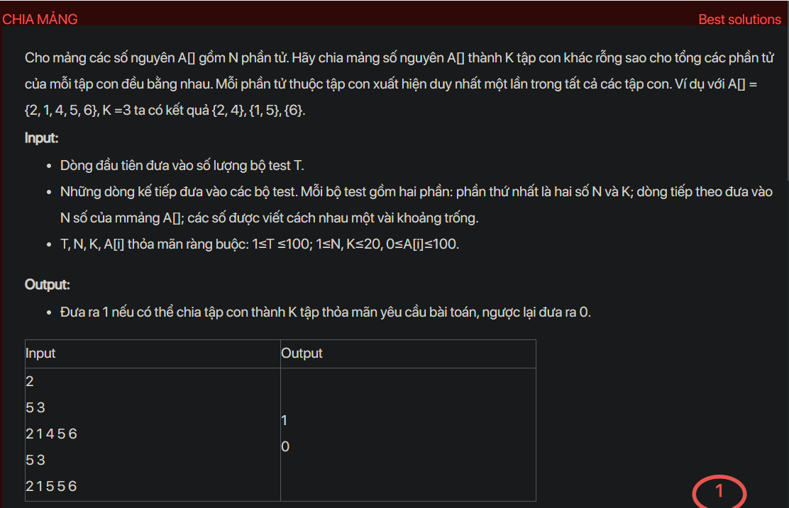

## dsa02009

## Approach
Problem Analysis:
The problem is about partitioning an array into K non-empty subsets such that the sum of elements in each subset is equal. If it's possible, we return 1, otherwise, we return 0.

Solution Analysis:
This problem can be solved using backtracking. The idea is to create an array of size K to store the sum of elements in each subset. We initialize all values in this array as 0. We also sort the input array in decreasing order. We start by putting every element in some subset until we have exhausted all elements. If the sum of the current subset exceeds the required sum, we backtrack and try putting the element in the next subset.

Algorithm:
1. Check if N is less than K, if true return 0.
2. Calculate the sum of all elements in the array. If the sum is not divisible by K, return 0.
3. Sort the array in decreasing order.
4. Initialize an array to store the sum of elements in each subset and a visited array.
5. Start from the first element and try to put it in each subset.

Implementation in C++:

```cpp
#include<bits/stdc++.h>
using namespace std;

bool isKPartitionPossibleRec(int arr[], int subsetSum[], bool taken[],
                            int subset, int K, int N, int curIdx, int limitIdx)
{
    if (subsetSum[curIdx] == subset)
    {
        if (curIdx == K - 2)
            return true;
        return isKPartitionPossibleRec(arr, subsetSum, taken, subset,
                                        K, N, curIdx + 1, N - 1);
    }
    for (int i = limitIdx; i >= 0; i--)
    {
        if (taken[i])
            continue;
        int tmp = subsetSum[curIdx] + arr[i];
        if (tmp <= subset)
        {
            taken[i] = true;
            subsetSum[curIdx] += arr[i];
            bool nxt = isKPartitionPossibleRec(arr, subsetSum, taken,
                                                subset, K, N, curIdx, i - 1);
            taken[i] = false;
            subsetSum[curIdx] -= arr[i];
            if (nxt)
                return true;
        }
    }
    return false;
}

bool isKPartitionPossible(int arr[], int N, int K)
{
    if (K == 1)
        return true;
    if (N < K)
        return false;
    int sum = 0;
    for (int i = 0; i < N; i++)
        sum += arr[i];
    if (sum % K != 0)
        return false;
    int subset = sum / K;
    bool taken[N];
    for (int i = 0; i < N; i++)
        taken[i] = false;
    int subsetSum[K];
    for (int i = 0; i < K; i++)
        subsetSum[i] = 0;
    subsetSum[0] = arr[N - 1];
    taken[N - 1] = true;
    return isKPartitionPossibleRec(arr, subsetSum, taken, subset, K, N, 0, N - 1);
}

int main()
{
    int T;
    cin >> T;
    while(T--)
    {
        int N, K;
        cin >> N >> K;
        int arr[N];
        for(int i = 0; i < N; i++)
            cin >> arr[i];
        sort(arr, arr + N, greater<int>());
        if(isKPartitionPossible(arr, N, K))
            cout << "1\n";
        else
            cout << "0\n";
    }
    return 0;
}
```

Time Complexity Analysis:
The time complexity of the solution is O(N^K) where N is the number of elements and K is the number of subsets. This is because in the worst case, we are trying to put each element in each subset. The space complexity is O(N) for storing the array, taken array, and subsetSum array.