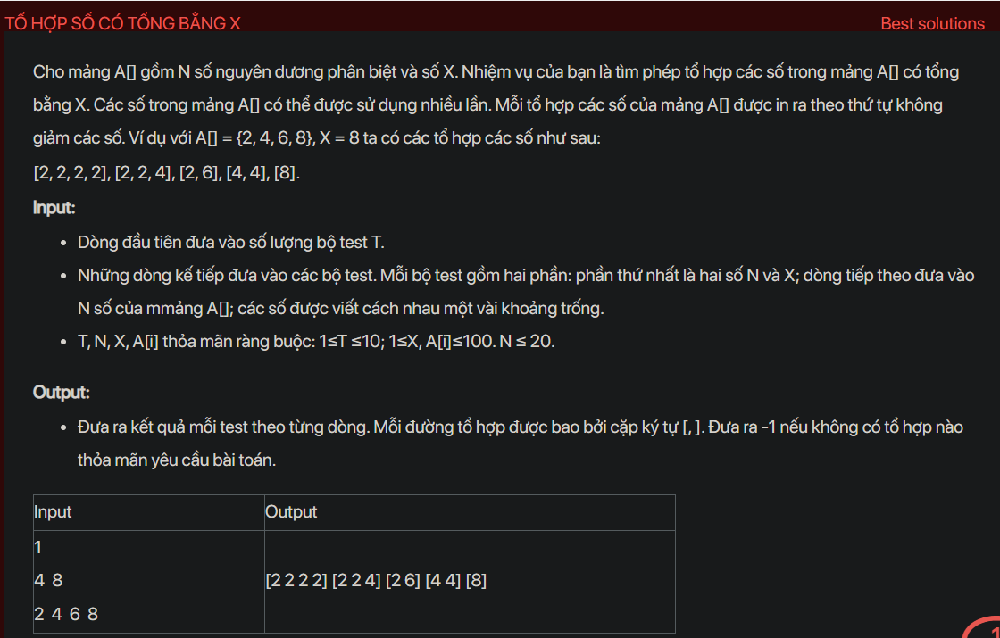

## dsa02010

## Approach
**Problem Analysis:**

The problem is asking to find all combinations of numbers from an array that sum up to a given number X. The numbers in the array can be used multiple times.

**Solution Analysis:**

This problem can be solved using a recursive approach. The idea is to start from the first number and for each number, we can either include it in the current combination or exclude it. We repeat this process until the sum of the numbers in the current combination is equal to X.

**Implementation in C++:**

```cpp
#include<bits/stdc++.h>
using namespace std;

void findCombinations(vector<int>& A, int X, vector<int>& combination, int start) {
    if (X == 0) {
        cout << "[";
        for (int i = 0; i < combination.size(); i++) {
            if (i != 0)
                cout << " ";
            cout << combination[i];
        }
        cout << "]" << endl;
        return;
    }
    for (int i = start; i < A.size(); i++) {
        if (A[i] <= X) {
            combination.push_back(A[i]);
            findCombinations(A, X - A[i], combination, i);
            combination.pop_back();
        }
    }
}

int main() {
    int T;
    cin >> T;
    while (T--) {
        int N, X;
        cin >> N >> X;
        vector<int> A(N);
        for (int i = 0; i < N; i++)
            cin >> A[i];
        sort(A.begin(), A.end());
        vector<int> combination;
        findCombinations(A, X, combination, 0);
    }
    return 0;
}
```

**Time Complexity Analysis:**

The time complexity of the solution is O(N^X) where N is the size of the array and X is the target sum. This is because in the worst case, we are generating all possible combinations of the numbers in the array. This is exponential time complexity. However, since the constraints of the problem are small (N ≤ 20, X ≤ 100), this solution will run in a reasonable amount of time.