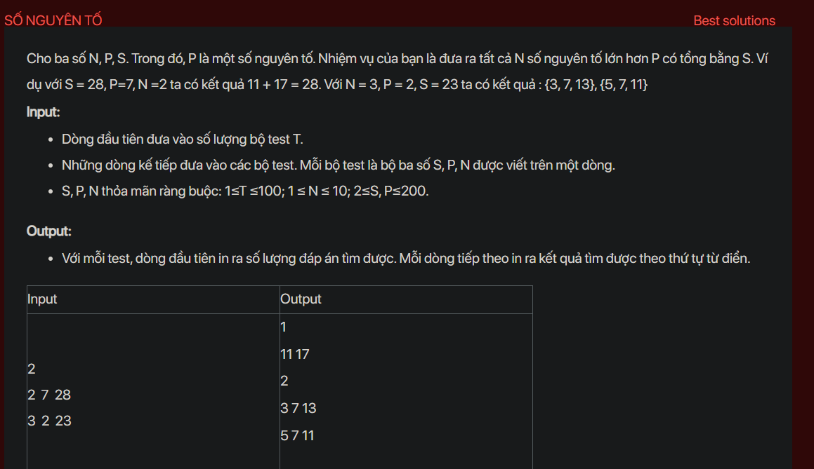

## dsa02013


## Approach
**Problem Analysis:**

The problem is asking to find all combinations of N prime numbers greater than P that sum up to S. 

**Solution Analysis:**

This problem can be solved using a recursive approach. The idea is to generate all prime numbers greater than P and for each prime number, we can either include it in the current combination or exclude it. We repeat this process until the sum of the numbers in the current combination is equal to S and the size of the combination is equal to N.

**Implementation in C++:**

```cpp
#include<bits/stdc++.h>
using namespace std;

vector<int> primes;
vector<vector<int>> results;

void generatePrimes(int P, int S) {
    vector<bool> prime(S+1, true);
    for (int p = 2; p*p <= S; p++) {
        if (prime[p] == true) {
            for (int i = p*p; i <= S; i += p)
                prime[i] = false;
        }
    }
    for (int p = P+1; p <= S; p++)
        if (prime[p])
            primes.push_back(p);
}

void findCombinations(int S, int N, vector<int>& combination, int start) {
    if (S == 0 && combination.size() == N) {
        results.push_back(combination);
        return;
    }
    for (int i = start; i < primes.size(); i++) {
        if (primes[i] <= S) {
            combination.push_back(primes[i]);
            findCombinations(S - primes[i], N, combination, i+1);
            combination.pop_back();
        }
    }
}

int main() {
    int T;
    cin >> T;
    while (T--) {
        int S, P, N;
        cin >> S >> P >> N;
        primes.clear();
        results.clear();
        generatePrimes(P, S);
        vector<int> combination;
        findCombinations(S, N, combination, 0);
        cout << results.size() << endl;
        for (auto& result : results) {
            for (int num : result)
                cout << num << " ";
            cout << endl;
        }
    }
    return 0;
}
```

**Time Complexity Analysis:**

The time complexity of the solution is O(N^S) where N is the number of prime numbers and S is the target sum. This is because in the worst case, we are generating all possible combinations of the prime numbers. This is exponential time complexity. However, since the constraints of the problem are small (N ≤ 10, S ≤ 200), this solution will run in a reasonable amount of time.