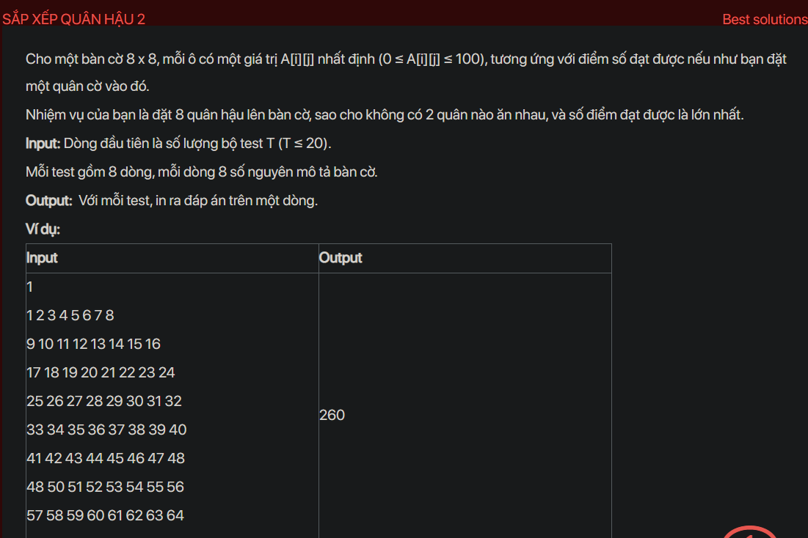

## dsa02017


## Approach
**Problem Analysis:**

Given an 8x8 chessboard, each cell has a certain value A[i][j] (0 ≤ A[i][j] ≤ 100), corresponding to the score achieved if you place a chess piece there. Your task is to place 8 queens on the chessboard, so that no two queens threaten each other, and the score achieved is the highest.

**Solution Analysis:**

This problem can be solved using a backtracking approach. The idea is to try to place a queen in each cell of the chessboard, and if a valid placement is found, move on to the next row. If no valid placement can be found in a row, backtrack and try a different placement for the queen in the previous row.

The algorithm to solve this problem can be described as follows:

1. Initialize a maximum score as -1.

2. For each cell in the first row, place a queen there and recursively try to place queens in the remaining rows. If a valid placement is found, update the maximum score.

3. The maximum score after trying all possible placements is the answer.

**Implementation in C++:**

```cpp
#include <bits/stdc++.h>
using namespace std;

int A[8][8], row[8], maxScore;

bool place(int r, int c) {
    for (int prev = 0; prev < c; prev++)
        if (row[prev] == r || (abs(row[prev] - r) == abs(prev - c)))
            return false;
    return true;
}

void backtrack(int c) {
    if (c == 8) {
        int score = 0;
        for (int i = 0; i < 8; i++)
            score += A[i][row[i]];
        maxScore = max(maxScore, score);
    }
    for (int r = 0; r < 8; r++)
        if (place(r, c)) {
            row[c] = r;
            backtrack(c + 1);
        }
}

int main() {
    int T;
    cin >> T;
    while (T--) {
        for (int i = 0; i < 8; i++)
            for (int j = 0; j < 8; j++)
                cin >> A[i][j];
        maxScore = -1;
        backtrack(0);
        cout << maxScore << endl;
    }
    return 0;
}
```

**Time Complexity Analysis:**

The time complexity of the algorithm is O(T * 8^8), where T is the number of test cases. This is because for each test case, we are trying all possible placements for the queens, which takes O(8^8) time, and we are doing this for T test cases. The space complexity of the algorithm is O(1), as we are using only a constant amount of space. This is efficient enough for the given problem constraints (T ≤ 20).