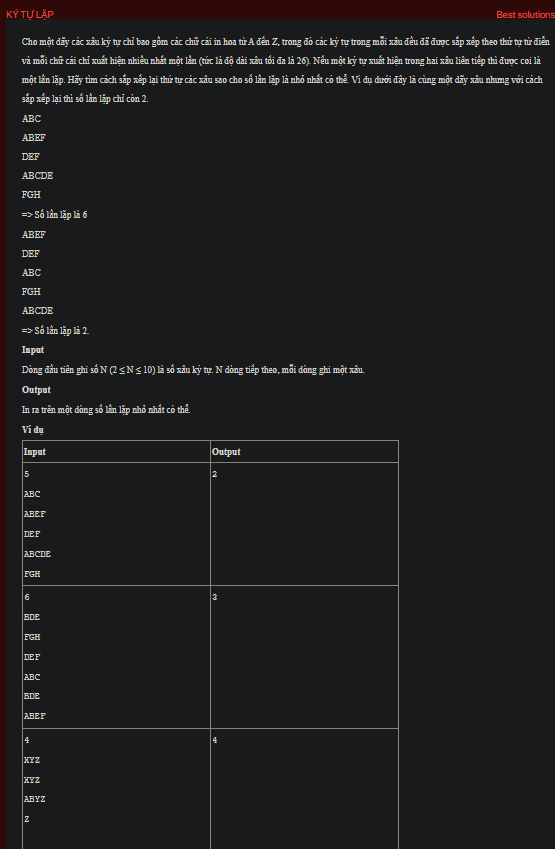

## dsa02025

## Explain
Sure, let's break down the algorithm in your code:

1. **Initialization:** The code starts by initializing an array `s` to store the strings, an integer `n` to store the number of strings, a boolean array `visited` to keep track of which strings have been used in the current permutation, a 2D array `f` to store the number of common characters between each pair of strings, an array `x` to store the current permutation, and an integer `res` to store the minimum number of common characters found so far.

2. **Reading the input:** The `testCase` function reads the number of strings `n` and the strings themselves from the input. It then calculates the number of common characters between each pair of strings and stores the result in the 2D array `f`.

3. **Generating permutations:** The `Try` function generates all permutations of the strings using a recursive backtracking approach. For each string that hasn't been used in the current permutation, it marks the string as used, adds it to the current permutation, and makes a recursive call to generate the rest of the permutation. If a complete permutation has been generated, it checks the number of common characters in this permutation.

4. **Checking a permutation:** The `check` function calculates the total number of common characters in the current permutation by summing up the number of common characters between each pair of adjacent strings in the permutation. It then updates `res` with the minimum of `res` and the calculated total.

5. **Counting common characters:** The `count` function counts the number of common characters between two strings. It does this by creating a map where the keys are the characters and the values are the number of occurrences of each character in both strings. It then counts the number of keys that have a value greater than 1, which corresponds to the number of common characters.

6. **Printing the result:** Finally, the `testCase` function prints the minimum number of common characters found, which is stored in `res`.

This algorithm essentially tries all possible permutations of the strings and finds the one that has the minimum total number of common characters between each pair of adjacent strings. It uses a backtracking approach to generate the permutations, which is a common technique for solving combinatorial problems.