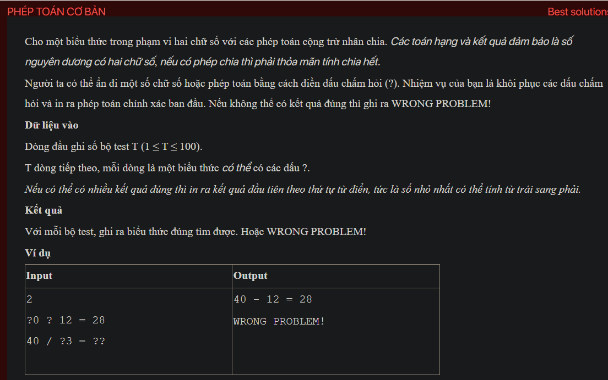

## dsa02026

## Explain
Sure, let's break down the algorithm in your code:

1. **Initialization:** The code starts by initializing a string `str` to store the input expression, an array `sign` to store the possible operators, and a boolean `isOK` to indicate whether a valid expression has been found.

2. **Reading the input:** The `testCase` function reads an expression from the input. If the expression contains a multiplication or division operator, it immediately prints "WRONG PROBLEM!" and returns, because the problem doesn't allow these operators.

3. **Generating expressions:** The `Try` function generates all possible expressions by replacing each '?' in the input expression with a possible value. If the current character is not a '?', it simply moves to the next character. If the current character is a '?', it tries to replace it with each possible value and makes a recursive call to generate the rest of the expression. If the '?' is at the position of the operator, it tries to replace it with each possible operator. Otherwise, it tries to replace it with each digit from 0 to 9. If a complete expression has been generated, it checks whether the expression is correct.

4. **Checking an expression:** The `isCorrect` function checks whether an expression is correct. It first extracts the operands and the result from the expression and checks whether they are all two-digit numbers. If not, it returns false. It then checks whether the operation in the expression is correct. If the operator is '+', it checks whether the sum of the operands equals the result. If the operator is '-', it checks whether the difference of the operands equals the result.

5. **Printing the result:** If a correct expression is found, the `Try` function sets `isOK` to true and prints the expression. If no correct expression is found after trying all possible expressions, the `testCase` function prints "WRONG PROBLEM!".

This algorithm essentially tries all possible expressions that can be formed by replacing the '?'s in the input expression with possible values, and finds the first one that is correct. It uses a backtracking approach to generate the expressions, which is a common technique for solving combinatorial problems.