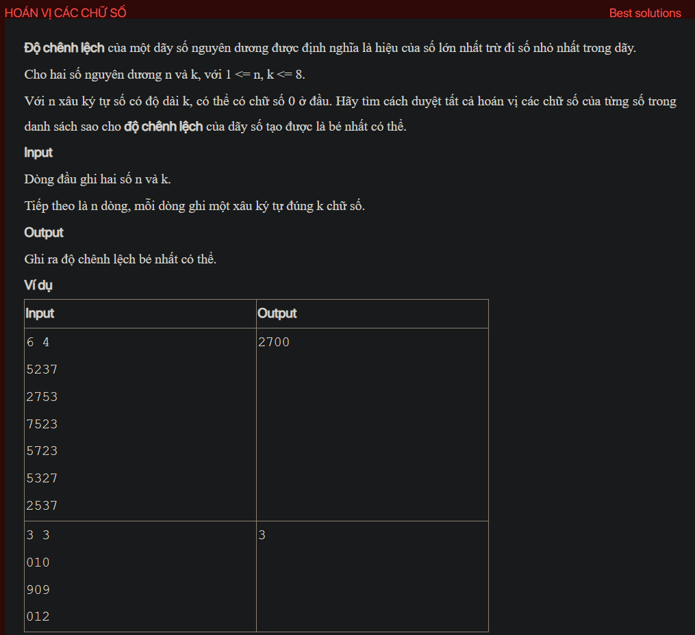

## dsa02035

## Explain
Sure, let's break down the algorithm in your code:

1. **Initialization:** The code starts by initializing an array `a` to store the input strings, an array `b` to store the permuted strings, an integer `n` to store the number of strings, an integer `k` to store the length of each string, a boolean array `visited` to keep track of which positions have been used in the current permutation, an array `x` to store the current permutation, and an integer `res` to store the minimum difference found so far.

2. **Reading the input:** The `testCase` function reads the values of `n` and `k` from the input, initializes `res` to the maximum possible value, and reads the `n` strings into the array `a`. It also copies the strings from `a` to `b`.

3. **Generating permutations:** The `Try` function generates all permutations of the positions of the digits in each string using a recursive backtracking approach. For each position that hasn't been used in the current permutation, it marks the position as used, adds it to the current permutation, and makes a recursive call to generate the rest of the permutation. If a complete permutation has been generated, it calls the `solve` function to calculate the difference for this permutation.

4. **Calculating the difference:** The `solve` function first permutes the digits in each string according to the current permutation. It then sorts the permuted strings and converts the first and last strings to integers to get the minimum and maximum values. It calculates the difference between the maximum and minimum values and updates `res` with the minimum of `res` and the calculated difference.

5. **Printing the result:** Finally, the `testCase` function prints the minimum difference found, which is stored in `res`.

This algorithm essentially tries all possible permutations of the positions of the digits in each string and finds the one that results in the minimum difference between the maximum and minimum values. It uses a backtracking approach to generate the permutations, which is a common technique for solving combinatorial problems.