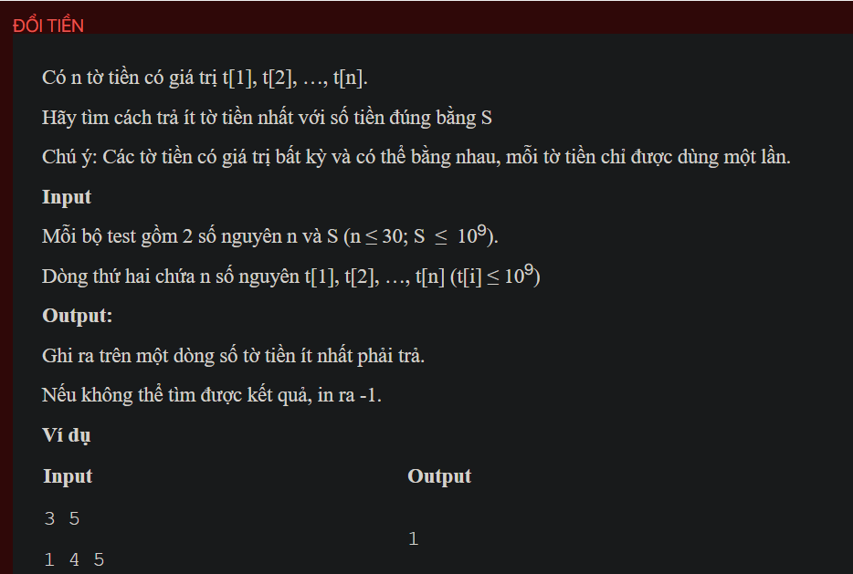

## dsakt012

## explain
The problem is about finding the minimum number of banknotes needed to pay a sum `S`. Each banknote can only be used once.

Here's a step-by-step explanation of the algorithm used in your code:

1. **Initialization:** The code first reads the number of banknotes `n` and the sum `S`. It also reads the values of the banknotes into the array `money`. It then sorts the array `money` in ascending order.

2. **Recursive function:** The function `Try` is a recursive function that tries to pay a sum `sum_money` using the banknotes from `money[0]` to `money[lim]`. It also keeps track of the number of banknotes used in `cnt`.

   - If `sum_money` is less than 0, it returns immediately because it is not possible to pay a negative sum.

   - If `sum_money` is 0, it sets `check` to true and `res` to `cnt` and returns. This means that it has found a way to pay the sum using `cnt` banknotes.

   - If `sum_money` is greater than 0, it tries to pay the sum by subtracting `money[j]` from `sum_money` for each `j` from `lim` to 0. It also increments `cnt` by 1.

3. **Processing the test case:** The code then calls `Try(s, n - 1, 0)` to try to pay the sum `s` using the banknotes from `money[0]` to `money[n - 1]`.

4. **Output:** Finally, the code outputs `res` if `check` is true, and -1 otherwise.

The reason this algorithm works is that it uses a recursive function to explore all possible ways to pay the sum. It starts by trying to pay the sum using the largest banknote, and if that is not possible, it tries to pay the sum using the next largest banknote, and so on. This ensures that it finds the way to pay the sum using the minimum number of banknotes.


```cpp
#include <bits/stdc++.h>
using namespace std;
int money[100];

bool check = false;
int res;
int n, s;
void testCase();
void Try(int sum_money, int lim, int cnt);
int main() {
    // Write your code here
    #ifndef ONLINE_JUDGE
    freopen("input.txt", "r", stdin);
    freopen("output.txt", "w", stdout);
    #endif
    testCase();
    return 0;
}
void Try(int sum_money, int lim, int cnt) {
    if (check) return;
    if (sum_money < 0) return;
    if (sum_money == 0) {
        check = 1;
        res = cnt;
        return;
    }
    for (int j = lim; j >= 0; j--) {
        Try(sum_money - money[j], j - 1, cnt + 1);
    }
}
void testCase() {
    cin >> n >> s;

    for (int i = 0; i < n; i++) cin >> money[i];
    sort(money, money + n);

    check = false;
    Try(s, n - 1, 0);

    if (check)
        cout << res << endl;
    else cout << -1 << endl;
}
```