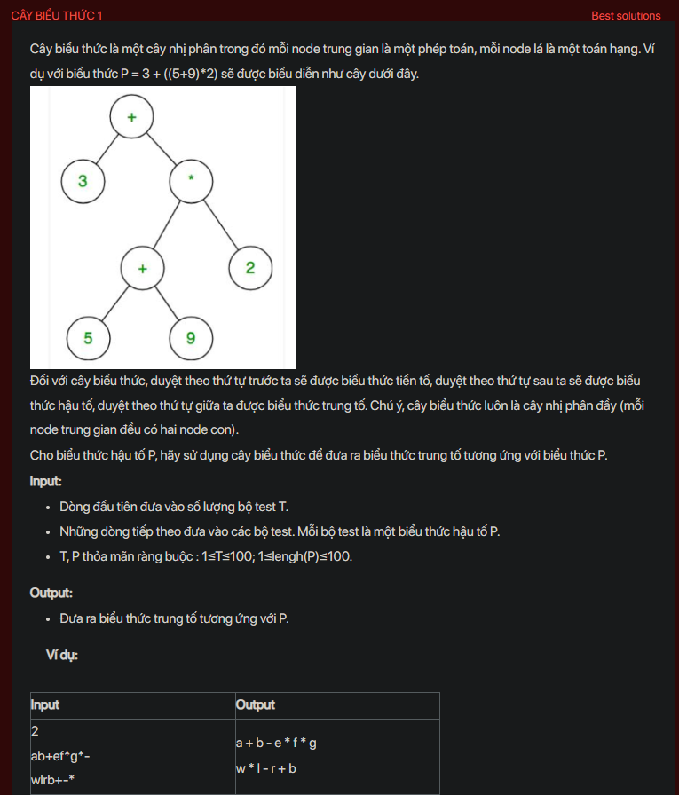

## dsa11001


```cpp
#include <bits/stdc++.h>
using namespace std;
void testCase();
bool isOperator(char c);
int main() {
    // Write your code here
    #ifndef ONLINE_JUDGE
    freopen("input.txt", "r", stdin);
    freopen("output.txt", "w", stdout);
    #endif
    int t;
    cin >> t;
    while (t--) {
        testCase();
        cout << endl;
    }
    return 0;
}
bool isOperator(char c) {
    switch(c) {
        case '+':
        case '-':
        case '*':
        case '/':
            return true;
    }
    return false;
}
void testCase() {
    string s;
    cin >> s;
    stack<string> st;
    int length = s.size();
    for (int i = 0; i < length; i++) {
        string z = "";
        if (isOperator(s[i])) {
            string op1 = st.top();st.pop();
            string op2 = st.top(); st.pop();
            z = op2 + s[i] + op1;
            
        } else {
            z += s[i];
            
        }
        st.push(z);
    }
    cout << st.top();

}
```