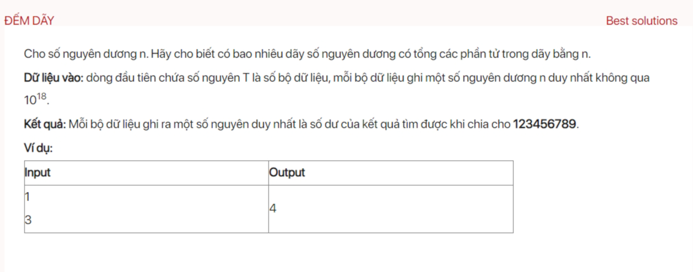

## dsa04003

số đầu tiên, ta có thể chọn là 1 hoặc 2 hoặc 3.... hoặc n. Nên ta có công thức truy hồi.

Gọi S[k] là số cách phân tích số k.

S[n]=S[0]+S[1]+S[2]+..+S[n-2]+S[n-1].

S[n]=(S[0]+S[1]+S[2]+..+S[n-2])+S[n-1].

S[n]=S[n-1]+S[n-1].

Vậy ta có thuật toán

S[1]=1

S[k]=2^(k-1)*n