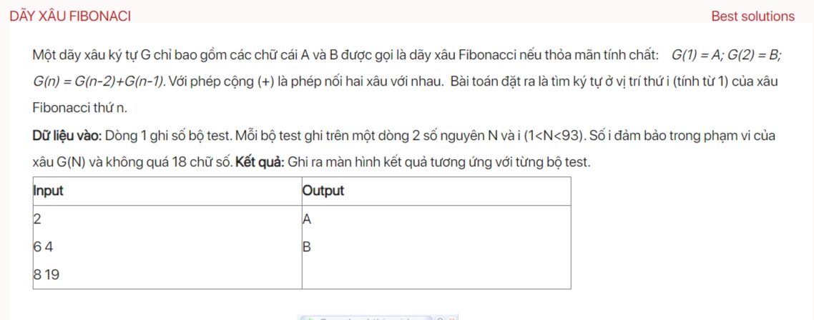

## dsa04005


## Approach
Problem Analysis:
The problem is asking to generate a Fibonacci-like sequence of strings where each string is formed by concatenating the previous two strings. The sequence starts with `G(1) = "A"` and `G(2) = "B"`. For a given `N` and `i`, we need to find the `i-th` character in the `N-th` string.

Solution:
The solution to this problem is to observe that the length of the `N-th` string is the `N-th` Fibonacci number. So, we can find the `i-th` character by recursively dividing the string into two halves. If `i` is in the left half, we continue with the left half. If `i` is in the right half, we continue with the right half and adjust `i` accordingly.

Here are the steps in detail:

1. Read the number of test cases `T`.
2. For each test case, do the following:
   1. Read `N` and `i`.
   2. Call a recursive function `findCharacter` with `N` and `i` to find the `i-th` character.
   3. Print the `i-th` character.

Implementation in C++:

```cpp
#include <iostream>
#include <vector>
using namespace std;

vector<long long> fib = {0, 1, 1};

char findCharacter(int N, long long i) {
    if (N == 1) {
        return 'A';
    }
    if (N == 2) {
        return 'B';
    }
    if (i <= fib[N - 2]) {
        return findCharacter(N - 2, i);
    } else {
        return findCharacter(N - 1, i - fib[N - 2]);
    }
}

void testCase() {
    int N;
    long long i;
    cin >> N >> i;
    while (fib.size() <= N) {
        fib.push_back(fib.back() + *(fib.end() - 2));
    }
    cout << findCharacter(N, i) << "\n";
}

int main() {
    int T;
    cin >> T;
    while (T--) {
        testCase();
    }
    return 0;
}
```

Time Complexity Analysis:
The time complexity of this solution is O(N) for each test case because we are recursively dividing the string into two halves until we find the `i-th` character. The total time complexity is O(T*N) where T is the number of test cases and N is the maximum string index.