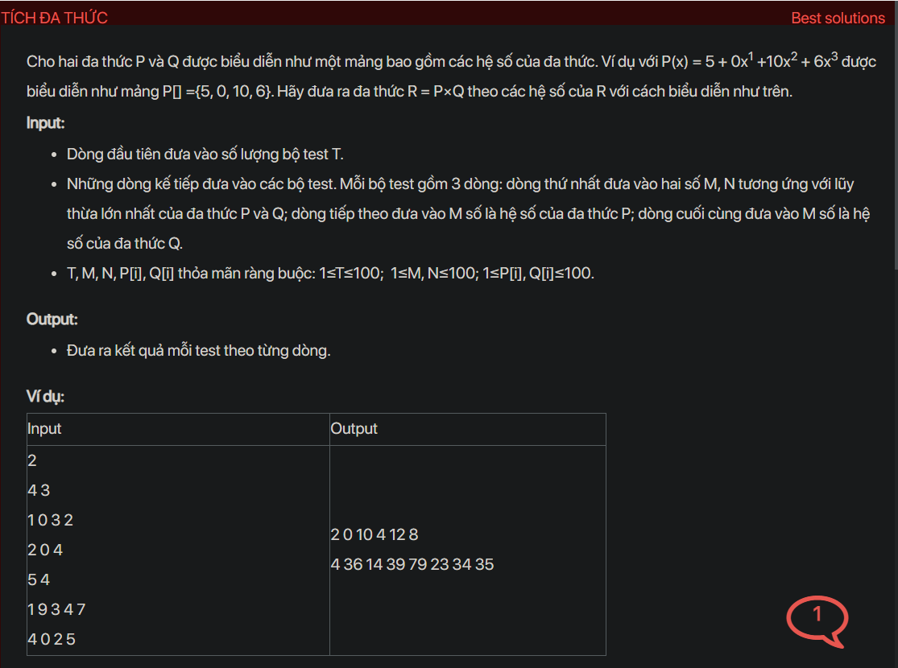

## dsa04012


## Approach
Problem Analysis:
The problem is asking to multiply two polynomials represented as arrays. The polynomials P and Q are represented as arrays of their coefficients. For example, P(x) = 5 + 0x1 +10x2 + 6x3 is represented as the array P[] ={5, 0, 10, 6}. We need to find the polynomial R = P×Q and represent it as an array of its coefficients.

Solution Analysis:
The multiplication of two polynomials is similar to the multiplication of two numbers. We multiply each term of the first polynomial with each term of the second polynomial and add the results. The degree of the resulting polynomial is the sum of the degrees of the two polynomials being multiplied. We can implement this process using a nested loop. The outer loop iterates over the terms of the first polynomial and the inner loop iterates over the terms of the second polynomial. For each pair of terms, we multiply their coefficients and add the result to the coefficient of the term in the resulting polynomial whose degree is the sum of the degrees of the two terms being multiplied.

Implementation in C++:

```cpp
#include<bits/stdc++.h>
using namespace std;

int main() {
    int T;
    cin >> T;
    while (T--) {
        int M, N;
        cin >> M >> N;
        vector<int> P(M), Q(N);
        for (int i = 0; i < M; i++) {
            cin >> P[i];
        }
        for (int i = 0; i < N; i++) {
            cin >> Q[i];
        }
        vector<int> R(M + N - 1, 0);
        for (int i = 0; i < M; i++) {
            for (int j = 0; j < N; j++) {
                R[i + j] += P[i] * Q[j];
            }
        }
        for (int i = 0; i < M + N - 1; i++) {
            cout << R[i] << " ";
        }
        cout << endl;
    }
    return 0;
}
```

Time Complexity Analysis:
The time complexity of the above solution is O(M * N) for each test case, where M and N are the degrees of the two polynomials. The space complexity is O(M + N) for the resulting polynomial.