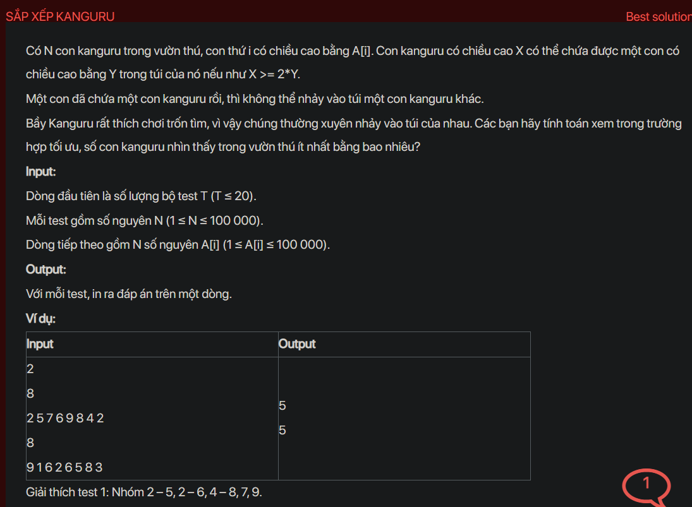

## dsa04013

## Approach
Problem Analysis:
The problem is about a group of kangaroos, each with a certain height. A kangaroo of height X can carry another kangaroo of height Y in its pouch if X >= 2*Y. Once a kangaroo carries another, it cannot be carried by any other kangaroo. The goal is to minimize the number of visible kangaroos by having them carry each other in the most optimal way.

Solution Analysis:
The solution to this problem involves sorting the kangaroos by height and then pairing them up in a specific way. We start by pairing the smallest kangaroo that hasn't been paired yet with the largest kangaroo that can carry it. This ensures that we minimize the number of visible kangaroos. If there's no such kangaroo that can carry it, we move on to the next smallest kangaroo. We repeat this process until all kangaroos have been considered.

Implementation in C++:

```cpp
#include<bits/stdc++.h>
using namespace std;

int main() {
    int T;
    cin >> T;
    while (T--) {
        int N;
        cin >> N;
        vector<int> A(N);
        for (int i = 0; i < N; i++) {
            cin >> A[i];
        }
        sort(A.begin(), A.end());
        int i = 0, j = N / 2;
        while (j < N && i < N / 2) {
            if (A[j] >= 2 * A[i]) {
                i++;
            }
            j++;
        }
        cout << N - i << endl;
    }
    return 0;
}
```

Time Complexity Analysis:
The time complexity of the solution is O(N log N) due to the sorting operation. The space complexity is O(N) for storing the heights of the kangaroos.