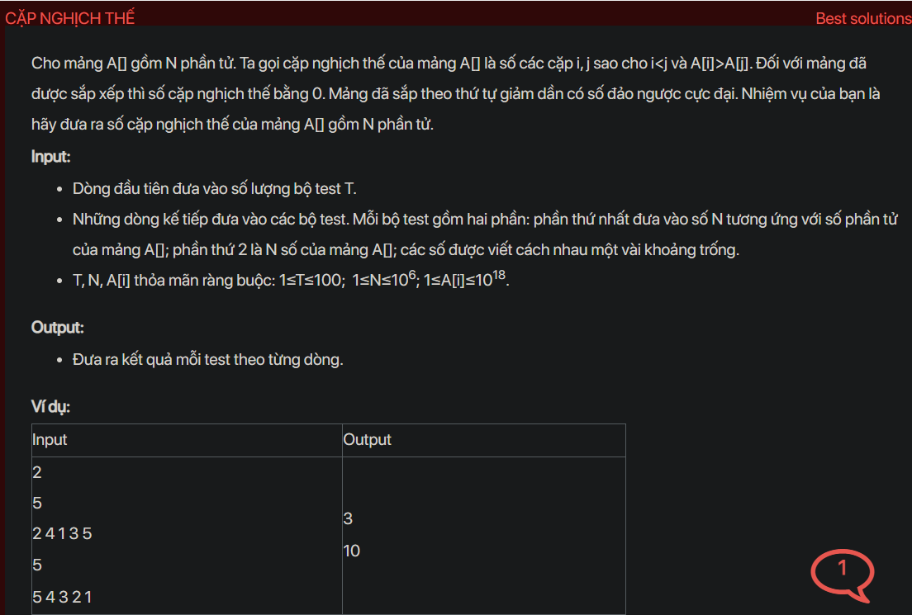

## dsa04014

## Approach
Problem Analysis:
The problem is asking to find the number of inversion pairs in an array. An inversion pair is a pair of elements (i, j) such that i < j and A[i] > A[j]. For a sorted array, the number of inversion pairs is 0. For a reverse sorted array, the number of inversion pairs is maximum.

Solution Analysis:
A simple way to solve this problem is to use a nested loop to count the number of inversion pairs. However, this approach has a time complexity of O(N^2) which is not efficient for large arrays. A more efficient approach is to use the concept of merge sort. In merge sort, the array is divided into two halves until we get subarrays of size 1. Then, these subarrays are merged together in a sorted manner. While merging, we can count the number of inversion pairs. If an element in the left subarray is greater than an element in the right subarray, then there are mid - i inversions (where mid is the middle index of the subarray), because left and right subarrays are sorted.

Implementation in C++:

```cpp
#include<bits/stdc++.h>
using namespace std;

long long merge(long long arr[], long long temp[], long long left, long long mid, long long right) {
    long long i, j, k;
    long long inv_count = 0;
    i = left;
    j = mid;
    k = left;
    while ((i <= mid - 1) && (j <= right)) {
        if (arr[i] <= arr[j]) {
            temp[k++] = arr[i++];
        }
        else {
            temp[k++] = arr[j++];
            inv_count = inv_count + (mid - i);
        }
    }
    while (i <= mid - 1)
        temp[k++] = arr[i++];
    while (j <= right)
        temp[k++] = arr[j++];
    for (i = left; i <= right; i++)
        arr[i] = temp[i];
    return inv_count;
}

long long _mergeSort(long long arr[], long long temp[], long long left, long long right) {
    long long mid, inv_count = 0;
    if (right > left) {
        mid = (right + left) / 2;
        inv_count += _mergeSort(arr, temp, left, mid);
        inv_count += _mergeSort(arr, temp, mid + 1, right);
        inv_count += merge(arr, temp, left, mid + 1, right);
    }
    return inv_count;
}

long long inversionCount(long long arr[], long long N) {
    long long temp[N];
    return _mergeSort(arr, temp, 0, N - 1);
}

int main() {
    int T;
    cin >> T;
    while (T--) {
        long long N;
        cin >> N;
        long long A[N];
        for (long long i = 0; i < N; i++) {
            cin >> A[i];
        }
        cout << inversionCount(A, N) << endl;
    }
    return 0;
}
```

Time Complexity Analysis:
The time complexity of the above solution is O(N log N) because it uses the merge sort algorithm. The space complexity is O(N) for the temporary array used in the merge sort algorithm.