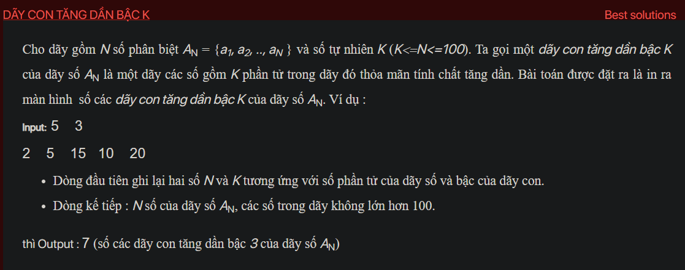

## ctdl004

## Explain
Sure, let's break it down further.

The problem is asking for the number of increasing subsequences of a certain length in a given sequence. A subsequence is a sequence that can be derived from another sequence by deleting some or no elements without changing the order of the remaining elements.

The brute force approach to this problem would be to generate all possible subsequences of the given sequence, check if they are increasing and if their length is equal to the given length. However, this approach would be very inefficient because the number of possible subsequences of a sequence is 2^n, where n is the length of the sequence. Therefore, we need a more efficient approach.

Dynamic programming is a method for solving complex problems by breaking them down into simpler subproblems and solving the subproblems only once, storing their solutions in case we need them later. This is exactly what we need for this problem.

The dynamic programming approach to this problem is based on the observation that an increasing subsequence of length k ending at position i in the sequence is formed by extending an increasing subsequence of length k-1 ending at some position j before i, where the element at position j is less than the element at position i.

Therefore, we can use a 2D array dp[i][j] to store the number of increasing subsequences of length j ending at position i. We initialize all elements of dp to 0, except for dp[i][1] which we set to 1 for all i, because a single element is always an increasing subsequence of length 1.

Then, for each length L from 2 to k, we iterate over all positions i in the sequence and for each position i, we iterate over all positions j before i. If the element at position j is less than the element at position i, we add dp[j][L-1] to dp[i][L], because every increasing subsequence of length L-1 ending at position j can be extended to an increasing subsequence of length L by adding the element at position i.

Finally, the number of increasing subsequences of length k is the sum of dp[i][k] for all i.

This approach is much more efficient than the brute force approach because it avoids redundant computations by storing the results of subproblems in the dp array. The time complexity of this approach is O(n^2 * k), which is feasible for the given problem constraints.