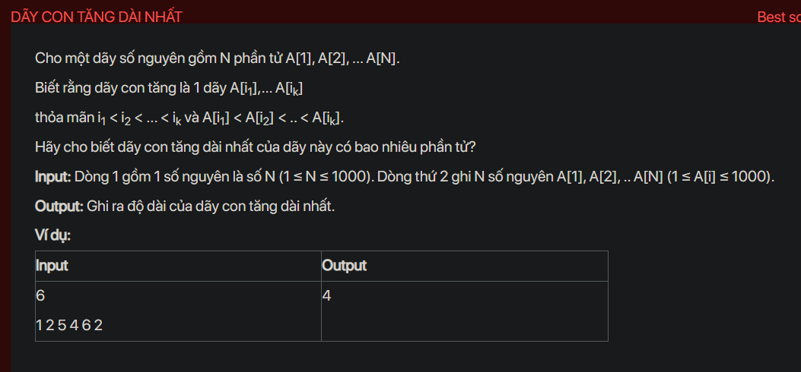

## dsa05004

## Approach
**Problem Analysis:**

The problem is about finding the length of the longest increasing subsequence (LIS) in a given array. An increasing subsequence is a subsequence where each element is greater than its previous element.

**Solution Analysis:**

The problem can be solved using dynamic programming. The idea is to create an array `dp` where `dp[i]` is the length of the LIS ending at index `i`.

The algorithm is as follows:

1. Initialize an array `dp` with size `n` and set all elements to 1. This is because a single element is always an increasing subsequence.

2. For each element `A[i]`:

   - For each previous element `A[j]` (where `j < i`):

     - If `A[j] < A[i]`, then `dp[i] = max(dp[i], dp[j] + 1)`. This is because we can extend the LIS ending at `j` by `A[i]`.

3. The length of the LIS is the maximum value in `dp`.

**Implementation in C++:**

```cpp
#include <bits/stdc++.h>
using namespace std;

int main() {
    int N;
    cin >> N;
    vector<int> A(N);
    for (int i = 0; i < N; i++) {
        cin >> A[i];
    }
    vector<int> dp(N, 1);
    for (int i = 1; i < N; i++) {
        for (int j = 0; j < i; j++) {
            if (A[j] < A[i]) {
                dp[i] = max(dp[i], dp[j] + 1);
            }
        }
    }
    cout << *max_element(dp.begin(), dp.end()) << endl;
    return 0;
}
```

**Time Complexity Analysis:**

The time complexity of the algorithm is O(n^2) because it involves a nested loop that iterates over the elements of the array. Here, `n` is the size of the array.