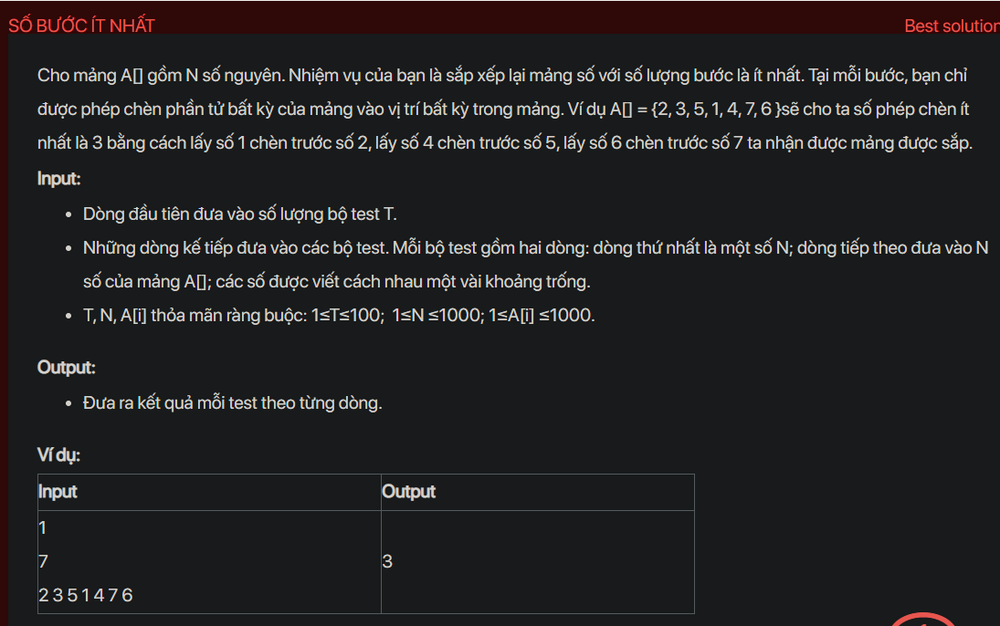

## dsa05005


## Approach
**Problem Analysis:**

The problem is about finding the minimum number of insertions to sort an array. In each step, you can remove an element from the array and insert it at any position.

**Solution Analysis:**

This problem can be solved using the concept of Longest Increasing Subsequence (LIS). The idea is that the minimum number of insertions to sort an array is equal to the total number of elements minus the length of the longest increasing subsequence.

The algorithm is as follows:

1. Find the longest increasing subsequence in the array.

2. Subtract the length of the longest increasing subsequence from the total number of elements.

**Implementation in C++:**

```cpp
#include <bits/stdc++.h>
using namespace std;

void testCase() {
    int n;
    cin >> n;
    vector<int> A(n);
    for (int i = 0; i < n; i++) {
        cin >> A[i];
    }
    vector<int> dp(n, 1);
    for (int i = 1; i < n; i++) {
        for (int j = 0; j < i; j++) {
            if (A[i] >= A[j] && dp[i] < dp[j] + 1) {
                dp[i] = dp[j] + 1;
            }
        }
    }
    int max_length = *max_element(dp.begin(), dp.end());
    cout << n - max_length << endl;
}

int main() {
    int T;
    cin >> T;
    while (T--) {
        testCase();
    }
    return 0;
}
```

**Time Complexity Analysis:**

The time complexity of the algorithm is O(n^2) because it involves two nested loops that iterate over the elements of the array. Here, `n` is the size of the array.