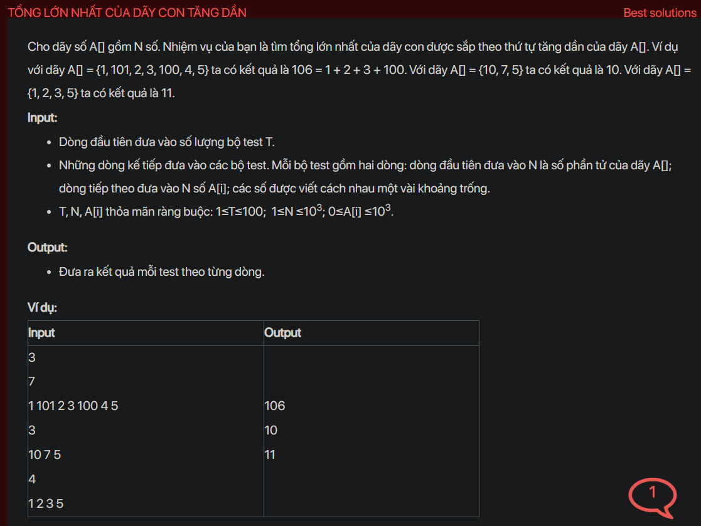

## dsa05006

## Approach
Problem Analysis:
The problem is asking to find the maximum sum of an increasing subsequence in an array. A subsequence is a sequence that can be derived from another sequence by deleting some or no elements without changing the order of the remaining elements.

Solution Analysis:
This problem can be solved using dynamic programming. We can create an array dp[] such that dp[i] stores the maximum sum of increasing subsequence ending with arr[i]. For each element in the array, we check if it is greater than its previous elements. If it is, we update the maximum sum. 

Implementation in C++:

```cpp
#include <iostream>
#include <vector>
#include <algorithm>
using namespace std;

int maxSumIS(vector<int>& arr) {
    int n = arr.size();
    vector<int> dp(n, 0);
    dp[0] = arr[0];
    for (int i = 1; i < n; i++) {
        dp[i] = arr[i];
        for (int j = 0; j < i; j++) {
            if (arr[i] > arr[j] && dp[i] < dp[j] + arr[i]) {
                dp[i] = dp[j] + arr[i];
            }
        }
    }
    return *max_element(dp.begin(), dp.end());
}

int main() {
    int t;
    cin >> t;
    while (t--) {
        int n;
        cin >> n;
        vector<int> arr(n);
        for (int i = 0; i < n; i++) {
            cin >> arr[i];
        }
        cout << maxSumIS(arr) << endl;
    }
    return 0;
}
```

Time Complexity Analysis:
The time complexity of the above solution is O(n^2) because there are two nested loops traversing the array. The space complexity is O(n) for the dp array.