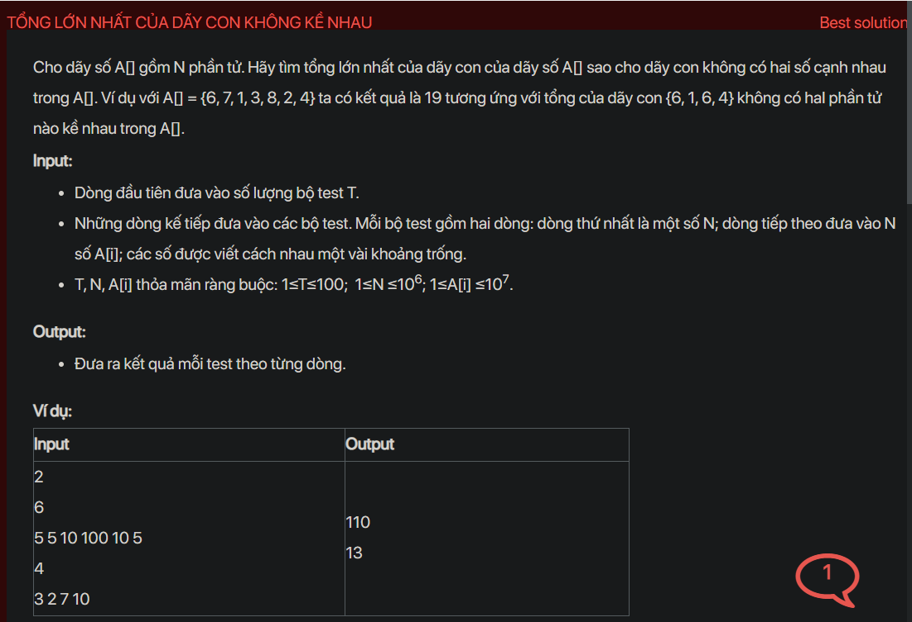

## dsa05007


## Approach
Problem Analysis:
The problem is asking to find the maximum sum of a subsequence in an array such that no two elements in the subsequence are adjacent in the original array.

Solution Analysis:
This problem can be solved using dynamic programming. We can create an array dp[] such that dp[i] stores the maximum sum of non-adjacent subsequence ending at index i. For each element in the array, we have two choices, either we include it in our subsequence or we exclude it. We choose the one which gives the maximum sum.

Implementation in C++:

```cpp
#include <iostream>
#include <vector>
#include <algorithm>
using namespace std;

long long maxSum(vector<int>& arr) {
    int n = arr.size();
    if(n == 1) return arr[0];
    vector<long long> dp(n, 0);
    dp[0] = arr[0];
    dp[1] = max(arr[0], arr[1]);
    for (int i = 2; i < n; i++) {
        dp[i] = max(dp[i-1], arr[i] + dp[i-2]);
    }
    return dp[n-1];
}

int main() {
    int t;
    cin >> t;
    while (t--) {
        int n;
        cin >> n;
        vector<int> arr(n);
        for (int i = 0; i < n; i++) {
            cin >> arr[i];
        }
        cout << maxSum(arr) << endl;
    }
    return 0;
}
```

Time Complexity Analysis:
The time complexity of the above solution is O(n) because we are traversing the array once. The space complexity is O(n) for the dp array.