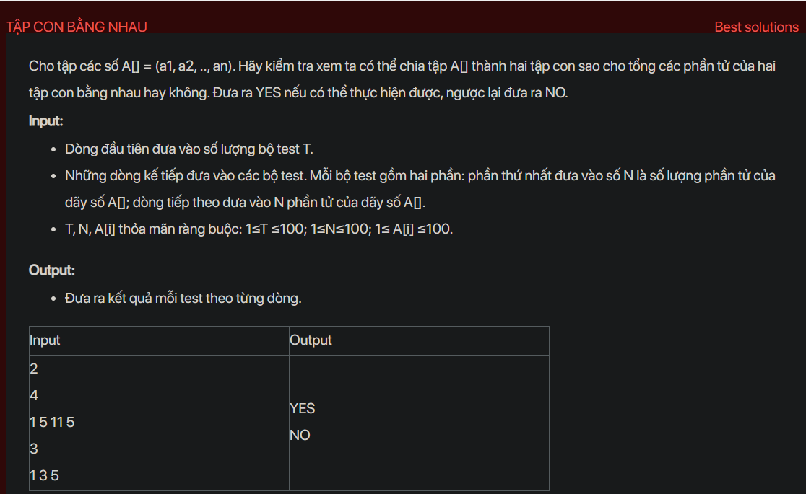

## dsa05009

## Dynamic programming approach
Problem Analysis:
The problem is asking to determine if a given array can be partitioned into two subsets such that the sum of elements in both subsets is equal.

Solution Analysis:
This problem can be solved using dynamic programming. The idea is to find a subset of array elements that has a sum equal to half of the total sum of the array. If such a subset exists, then the remaining elements in the array will form another subset with the same sum.

Implementation in C++:

```cpp
#include <bits/stdc++.h>
using namespace std;

bool isPartitionPossible(vector<int>& arr, int n) {
    int sum = accumulate(arr.begin(), arr.end(), 0);
    if (sum % 2 != 0) return false;
    sum /= 2;
    vector<vector<bool>> dp(n+1, vector<bool>(sum+1, false));
    for (int i = 0; i <= n; i++) dp[i][0] = true;
    for (int i = 1; i <= n; i++) {
        for (int j = 1; j <= sum; j++) {
            dp[i][j] = dp[i-1][j];
            if (j >= arr[i-1]) dp[i][j] = dp[i][j] || dp[i-1][j-arr[i-1]];
        }
    }
    return dp[n][sum];
}

int main() {
    int T;
    cin >> T;
    while (T--) {
        int N;
        cin >> N;
        vector<int> A(N);
        for (int i = 0; i < N; i++) cin >> A[i];
        cout << (isPartitionPossible(A, N) ? "YES" : "NO") << endl;
    }
    return 0;
}
```

Time Complexity Analysis:
The time complexity of the above solution is O(n*sum), where n is the number of elements in the array and sum is the total sum of the array elements. This is because we are filling up a 2D dp array of size n*sum. The space complexity is also O(n*sum) for the same reason.