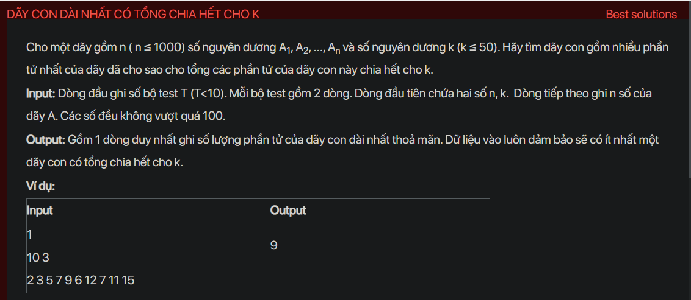

## dsa05010

## Approach
**Problem Analysis:**

The problem is to find the longest subsequence of the given sequence such that the sum of its elements is divisible by k.

**Solution Analysis:**

This problem can be solved using dynamic programming. The idea is to calculate the maximum length of the subsequence ending at each index that satisfies the condition, and update the overall maximum length.

The algorithm to solve this problem can be described as follows:

1. Initialize an array dp of size k to store the maximum length of the subsequence ending at each index that satisfies the condition. dp[i] is for the case where the sum of the subsequence modulo k is i.
2. For each element in the sequence from left to right, calculate dp[i] based on dp[(i-A[j]%k+k)%k] and dp[i], and update the overall maximum length.
3. The overall maximum length is the maximum value of dp[i].

**Implementation in C++:**

```cpp
#include <iostream>
#include <vector>
#include <algorithm>
using namespace std;

int main() {
    int T;
    cin >> T;
    while (T--) {
        int n, k;
        cin >> n >> k;
        vector<int> A(n);
        for (int i = 0; i < n; i++) {
            cin >> A[i];
        }
        vector<int> dp(k, -1);
        dp[0] = 0;
        int maxLength = 0;
        for (int i = 0; i < n; i++) {
            vector<int> dpNext = dp;
            for (int j = 0; j < k; j++) {
                if (dp[j] != -1) {
                    dpNext[(j+A[i])%k] = max(dpNext[(j+A[i])%k], dp[j]+1);
                }
            }
            dp = dpNext;
            maxLength = max(maxLength, dp[0]);
        }
        cout << maxLength << "\n";
    }
    return 0;
}
```

**Time Complexity Analysis:**

The time complexity of the algorithm is O(n*k), where n is the size of the sequence and k is the given number, because it iterates over all elements in the sequence and all possible sums modulo k. This is efficient enough for the given problem constraints (n ≤ 1000, k ≤ 50).