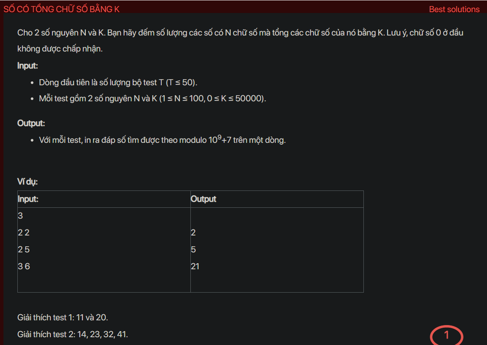

## dsa05011

## Approach
**Problem Analysis:**

The problem is to count the number of numbers with N digits such that the sum of its digits is K. Leading zeros are not allowed.

**Solution Analysis:**

This problem can be solved using dynamic programming. The idea is to calculate the number of numbers with i digits and the sum of digits j for all possible i and j, and use these results to calculate the final result.

The algorithm to solve this problem can be described as follows:

1. Initialize a 3D array dp of size N+1 by K+1 by 10 to store the number of numbers with i digits and the sum of digits j that the last digit is less than or equal to k. dp[i][j][k] is for the case where the number has i digits, the sum of digits is j, and the last digit is less than or equal to k.
2. For each digit from 1 to 9, calculate dp[1][digit][digit].
3. For each number of digits from 2 to N, for each sum of digits from 0 to K, for each last digit from 0 to 9, calculate dp[i][j][k] based on dp[i-1][j-k][l] for all possible l.
4. The final result is the sum of dp[N][K][k] for all possible k.

**Implementation in C++:**

```cpp
#include <iostream>
#include <vector>
using namespace std;

const int MOD = 1e9+7;

int main() {
    int T;
    cin >> T;
    while (T--) {
        int N, K;
        cin >> N >> K;
        vector<vector<vector<int>>> dp(N+1, vector<vector<int>>(K+1, vector<int>(10)));
        for (int digit = 1; digit <= 9; digit++) {
            if (digit <= K) {
                dp[1][digit][digit] = 1;
            }
        }
        for (int i = 2; i <= N; i++) {
            for (int j = 0; j <= K; j++) {
                for (int k = 0; k <= 9; k++) {
                    if (j >= k) {
                        for (int l = 0; l <= 9; l++) {
                            dp[i][j][k] = (dp[i][j][k] + dp[i-1][j-k][l]) % MOD;
                        }
                    }
                }
            }
        }
        int result = 0;
        for (int k = 0; k <= 9; k++) {
            result = (result + dp[N][K][k]) % MOD;
        }
        cout << result << "\n";
    }
    return 0;
}
```

**Time Complexity Analysis:**

The time complexity of the algorithm is O(N*K*10^2), where N is the number of digits and K is the sum of digits, because it iterates over all possible numbers of digits, sums of digits, and last digits. This is efficient enough for the given problem constraints (1 ≤ N ≤ 100, 0 ≤ K ≤ 50000).