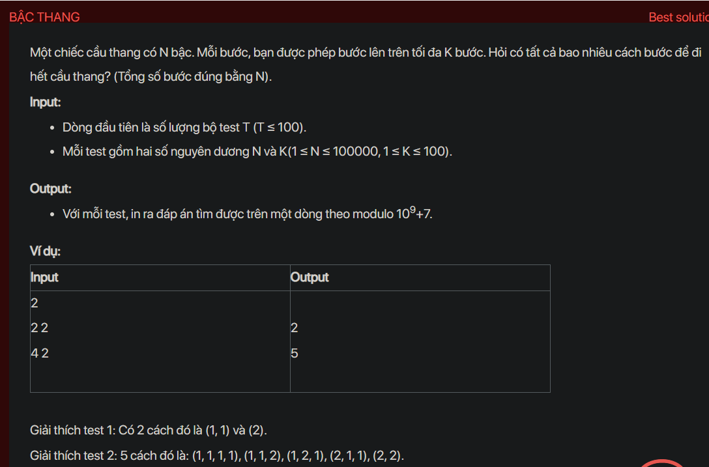

## dsa05013



## Approach
This problem can be solved using dynamic programming. The idea is to create a DP table where `dp[i]` is the number of ways to reach the `i`th step. For each step, we can reach it from any of the previous `k` steps.

Here's a step-by-step explanation of how to solve this problem:

1. **Analyse the problem:** We need to find the number of ways to reach the `N`th step of a staircase, where we can climb up to `K` steps at a time.

2. **Thinking chain to come up with the solution:** We can solve this problem by using dynamic programming. We create a DP table where `dp[i]` is the number of ways to reach the `i`th step. For each step, we can reach it from any of the previous `k` steps. So, `dp[i]` is the sum of `dp[i - j]` for all `j` from `1` to `k`. To optimize this, we can keep a running sum of the last `k` DP values, and subtract `dp[i - k - 1]` from it when `i > k`.

3. **Implement in C++:** 

```cpp
#include <bits/stdc++.h>
using namespace std;

const int MOD = 1e9 + 7;

int main() {
    int t;
    cin >> t;
    while (t--) {
        int n, k;
        cin >> n >> k;
        vector<int> dp(n + 1, 0);
        dp[0] = 1;
        int sum = 1;
        for (int i = 1; i <= n; i++) {
            if (i > k) sum = (sum - dp[i - k - 1] + MOD) % MOD;
            dp[i] = sum;
            sum = (sum + dp[i]) % MOD;
        }
        cout << dp[n] << endl;
    }
    return 0;
}
```

4. **Analyse time complexity:** The time complexity of this solution is O(n), where `n` is the number of steps. This is because we are processing each step exactly once. The space complexity is also O(n), as we are storing the DP table of size `n + 1`.