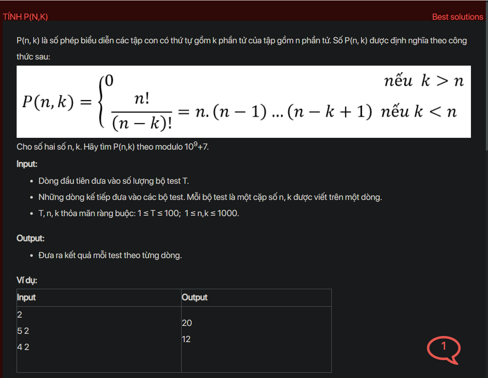

## dsa05015


## Explain 1

The `prepare` function (or `init` function in your code) is used to precompute all possible values of P(n, k) for n and k up to 1000. It uses the formula P(n, k) = n * P(n - 1, k - 1) % MOD, where MOD is the modulus 1e9 + 7.

Here's a step-by-step explanation:

1. For each i from 1 to 1000, it sets P[i][1] to 1. This is because there's only one way to choose 1 element from a set of i elements.

2. For each i from 2 to 1000, it calculates P[i][j] for each j from 2 to i using the formula P[i][j] = i * P[i - 1][j - 1] % MOD. This is based on the principle that the number of ways to choose j elements from a set of i elements is equal to i times the number of ways to choose j - 1 elements from a set of i - 1 elements.

The result is a 2D array P where P[i][j] is the number of ways to choose j elements from a set of i elements, modulo 1e9 + 7. This array is used to quickly answer queries in the `testCase` function.

## Explain 2

The `prepare` function (or `init` function in your code) is used to precompute all possible values of P(n, k) for n and k up to 1000. It uses the formula P(n, k) = n * P(n - 1, k - 1) % MOD, where MOD is the modulus 1e9 + 7.

Here's a step-by-step explanation:

1. For each i from 1 to 1000, it sets P[i][1] to 1. This is because there's only one way to choose 1 element from a set of i elements.

2. For each i from 2 to 1000, it calculates P[i][j] for each j from 2 to i using the formula P[i][j] = i * P[i - 1][j - 1] % MOD. This is based on the principle that the number of ways to choose j elements from a set of i elements is equal to i times the number of ways to choose j - 1 elements from a set of i - 1 elements.

The result is a 2D array P where P[i][j] is the number of ways to choose j elements from a set of i elements, modulo 1e9 + 7. This array is used to quickly answer queries in the `testCase` function.

```cpp
#include <bits/stdc++.h>
using namespace std;
const long long MOD = 1e9 + 7;
long long p[1001][1001];
void testCase();
void init();
int main() {
    // Write your code here
    #ifndef ONLINE_JUDGE
    freopen("input.txt", "r", stdin);
    freopen("output.txt", "w", stdout);
    #endif
    memset(p, 0, sizeof(p));
    int t;
    cin >> t;
    init();
    while (t--) {
        testCase();
        cout << endl;
    }
    return 0;
}
void init() {
    for (int i = 1; i < 1001; i++) {
        p[i][1] = i;
    }
    for (int i = 2; i < 1001; i++) {
        for (int j = 2; j <= i; j++) {
            p[i][j] = i * p[i - 1][j - 1] % MOD;
        }
    }
}
void testCase() {
    int n, k;
    cin >> n >> k;
    // cout << n << " " << k ;
    cout << p[n][k];
}
```