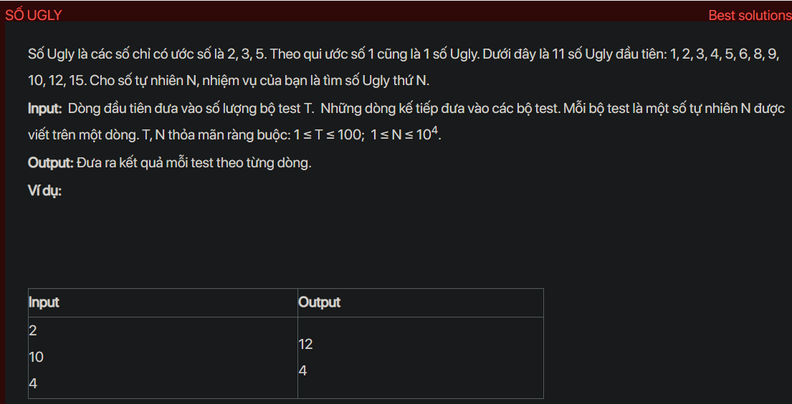

## dsa05016

## Approach
Problem Analysis:
The problem is asking to find the Nth Ugly number. An Ugly number is a number whose only prime factors are 2, 3, or 5.

Solution Analysis:
We can solve this problem using dynamic programming. We maintain a list of ugly numbers and generate new ugly numbers from existing ones by multiplying them by 2, 3, or 5, making sure to always choose the smallest ugly number that is not in the list yet.

Implementation in C++:

```cpp
#include<bits/stdc++.h>
using namespace std;

#define MAX 10000

unsigned ugly[MAX];

void uglyNumbers() {
    unsigned i2 = 0, i3 = 0, i5 = 0;
    unsigned next_multiple_of_2 = 2;
    unsigned next_multiple_of_3 = 3;
    unsigned next_multiple_of_5 = 5;
    unsigned next_ugly_no = 1;

    ugly[0] = 1;

    for (int i=1; i<MAX; i++) {
        next_ugly_no = min(next_multiple_of_2, min(next_multiple_of_3, next_multiple_of_5));
        ugly[i] = next_ugly_no;
        if (next_ugly_no == next_multiple_of_2) {
            i2 = i2+1;
            next_multiple_of_2 = ugly[i2]*2;
        }
        if (next_ugly_no == next_multiple_of_3) {
            i3 = i3+1;
            next_multiple_of_3 = ugly[i3]*3;
        }
        if (next_ugly_no == next_multiple_of_5) {
            i5 = i5+1;
            next_multiple_of_5 = ugly[i5]*5;
        }
    }
}

int main() {
    int t;
    cin >> t;
    uglyNumbers();
    while (t--) {
        int n;
        cin >> n;
        cout << ugly[n-1] << endl;
    }
    return 0;
}
```

Time Complexity Analysis:
The time complexity of the above solution is O(n) because we generate each ugly number in constant time. The space complexity is O(n) for the ugly array.