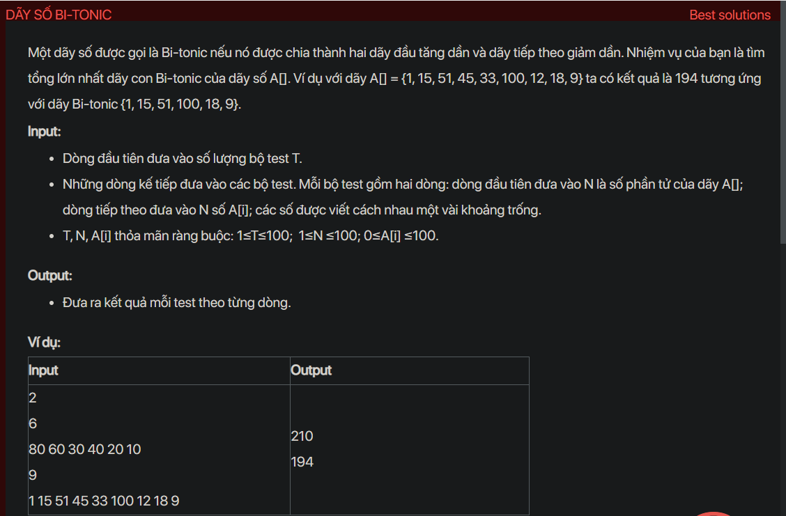

## dsa05017

## Approach
Problem Analysis:
The problem is asking to find the maximum sum of a bitonic subsequence in an array. A bitonic subsequence is a subsequence that first increases and then decreases.

Solution Analysis:
We can solve this problem using dynamic programming. We maintain two arrays, `inc` and `dec`, where `inc[i]` is the maximum sum of increasing subsequence ending at `i` and `dec[i]` is the maximum sum of decreasing subsequence starting from `i`. The maximum sum of bitonic subsequence is the maximum value of `inc[i] + dec[i] - arr[i]`.

Implementation in C++:

```cpp
#include<bits/stdc++.h>
using namespace std;

int maxBitonicSum(int arr[], int n) {
    int inc[n], dec[n];
    for (int i = 0; i < n; i++) {
        inc[i] = arr[i];
        dec[i] = arr[i];
    }

    for (int i = 1; i < n; i++)
        for (int j = 0; j < i; j++)
            if (arr[i] > arr[j] && inc[i] < inc[j] + arr[i])
                inc[i] = inc[j] + arr[i];

    for (int i = n-2; i >= 0; i--)
        for (int j = n-1; j > i; j--)
            if (arr[i] > arr[j] && dec[i] < dec[j] + arr[i])
                dec[i] = dec[j] + arr[i];

    int max = inc[0] + dec[0] - arr[0];
    for (int i = 1; i < n; i++)
        if (inc[i] + dec[i] - arr[i] > max)
            max = inc[i] + dec[i] - arr[i];

    return max;
}

int main() {
    int t;
    cin >> t;
    while (t--) {
        int n;
        cin >> n;
        int arr[n];
        for (int i = 0; i < n; i++)
            cin >> arr[i];
        cout << maxBitonicSum(arr, n) << endl;
    }
    return 0;
}
```

Time Complexity Analysis:
The time complexity of the above solution is O(n^2) because we use two nested loops to fill the `inc` and `dec` arrays. The space complexity is O(n) for the `inc`, `dec` and `arr` arrays.