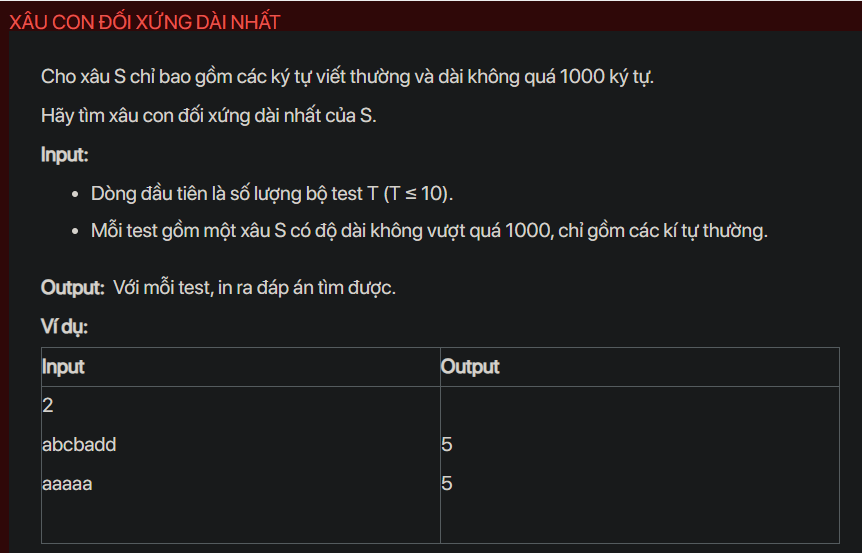

## dsa05018

## Approach
This code is solving the same problem as the previous one, finding the longest palindromic subsequence in a string, but with a different approach. Instead of finding the longest palindromic subsequence, it finds the longest palindromic substring.

Algorithm Explanation:

1. The code first reads the number of test cases.

2. For each test case, it reads a string `s` and initializes a 2D boolean array `f` where `f[i][j]` is `true` if the substring `s[i..j]` is a palindrome, and `false` otherwise.

3. It initializes `f[i][i] = true` for all `i` because every single character is a palindrome.

4. It then considers all substrings of `s`. For each substring `s[i..j]`, if `s[i] == s[j]` and the substring `s[i+1..j-1]` is a palindrome, then `s[i..j]` is a palindrome. If `s[i..j]` is a palindrome, it updates the maximum length of a palindromic substring.

5. Finally, it prints the maximum length of a palindromic substring.

This approach is different from the previous one because it finds the longest palindromic substring, not subsequence. A substring is a contiguous sequence of characters within a string, while a subsequence is not required to be contiguous.

Time Complexity Analysis:
The time complexity of the above solution is O(n^2) because we use two nested loops to fill the `f` array. The space complexity is O(n^2) for the `f` array.