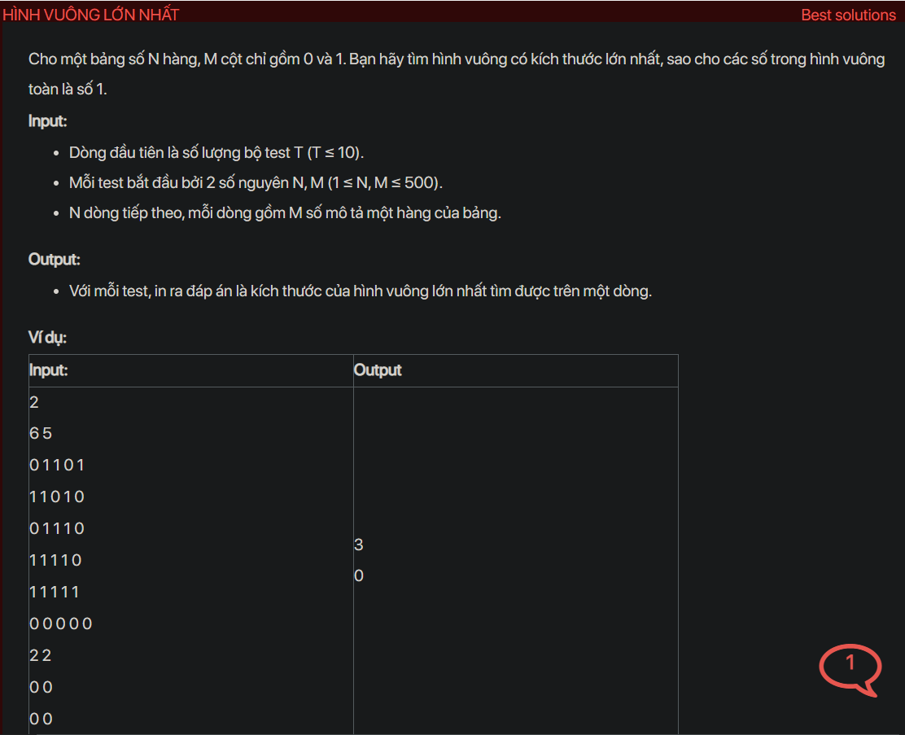

## dsa05019

## Explain
Sure, let's break down the algorithm in your code.

This algorithm is used to find the largest square sub-matrix of 1s in a given binary matrix. The main idea is to use dynamic programming to avoid redundant computation.

Here's a step-by-step explanation of the algorithm:

1. **Initialization:** The code first initializes a 2D array `f[][]` with the same size as the input matrix `a[][]`. This `f[][]` is an auxiliary matrix where each entry `f[i][j]` will represent the size of the square sub-matrix with all 1s including `a[i][j]` where `a[i][j]` is the rightmost and bottommost entry in the sub-matrix.

2. **Filling the auxiliary matrix:** The code then iterates over each entry in the input matrix starting from `a[1][1]`. If the entry is 0, it sets `f[i][j]` to 0 because a square sub-matrix cannot have 0 as its rightmost and bottommost entry. If the entry is 1, it sets `f[i][j]` to the minimum of `f[i-1][j]`, `f[i][j-1]`, and `f[i-1][j-1]` plus 1. This is because a square sub-matrix of 1s can only be extended by 1 if there are enough 1s above it, to its left, and diagonally above its left.

3. **Finding the maximum entry:** While filling the auxiliary matrix, the code also keeps track of the maximum entry in `f[][]` in the variable `res`. This is the size of the largest square sub-matrix of 1s.

4. **Output:** Finally, the code outputs the maximum size `res`.

The reason this algorithm works is that it builds up the solution by solving smaller sub-problems first. It uses the solutions to these sub-problems to solve the original problem. This is the essence of dynamic programming.

```cpp
#include <bits/stdc++.h>
using namespace std;
void testCase();
int main() {
    // Write your code here
    #ifndef ONLINE_JUDGE
    freopen("input.txt", "r", stdin);
    freopen("output.txt", "w", stdout);
    #endif
    int t;
    cin >> t;
    while (t--) {
        testCase();
        cout << endl;
    }
    return 0;
}
void testCase() {
    int n, m;
    cin >> n >> m;
    int a[501][501];
    memset(a, 0, sizeof(a));
    for (int i = 1; i <= n; i++) {
        for (int j=  1; j <= m; j++) {
            cin >> a[i][j];
        }
    }
    int res = 0;
    int f[501][501];
    memset(f, 0, sizeof(f));
    for (int i = 1; i <= n; i++) {
        for (int j = 1; j <= n; j++) {
            if (a[i][j] == 0) {
                f[i][j] = 0;
            } else {
                f[i][j] = min({f[i - 1][j], f[i][j - 1], f[i - 1][j - 1]}) + 1;
            }
            res = max(res, f[i][j]);
        }
    }
    cout << res;
}
```