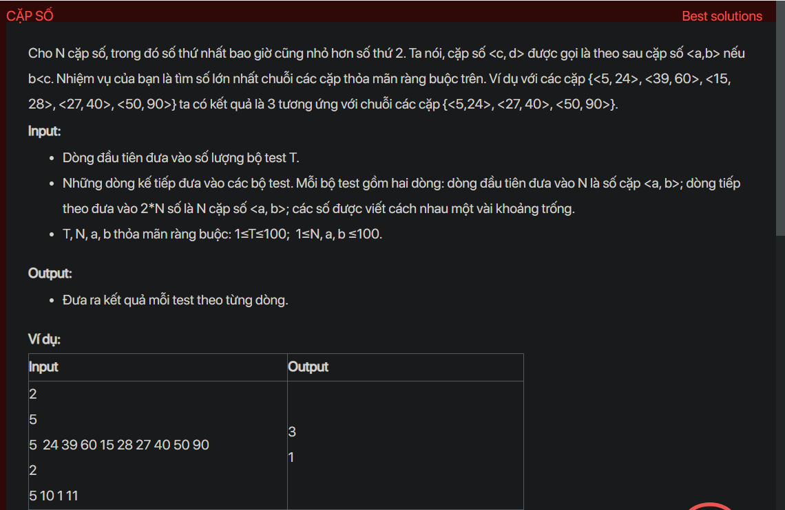

## dsa05021

## Approach
**Problem Analysis:**

The problem is to find the maximum length of a chain of pairs such that for each pair (c, d), d is less than c in the next pair. Each pair is ordered such that the first element is always less than the second.

**Solution Analysis:**

This problem can be solved using a greedy algorithm. The idea is to sort the pairs by the second element, and then iterate over the sorted pairs from left to right, adding a pair to the chain if its first element is greater than the second element of the last pair in the chain.

The algorithm to solve this problem can be described as follows:

1. Sort the pairs by the second element.
2. Initialize the chain with the first pair.
3. For each pair from the second to the last, if its first element is greater than the second element of the last pair in the chain, add it to the chain.
4. The maximum length of the chain is the number of pairs in the chain.

**Implementation in C++:**

```cpp
#include <iostream>
#include <vector>
#include <algorithm>
using namespace std;

bool compare(const pair<int, int>& a, const pair<int, int>& b) {
    return a.second < b.second;
}

int main() {
    int T;
    cin >> T;
    while (T--) {
        int N;
        cin >> N;
        vector<pair<int, int>> pairs(N);
        for (int i = 0; i < N; i++) {
            cin >> pairs[i].first >> pairs[i].second;
        }
        sort(pairs.begin(), pairs.end(), compare);
        int maxLength = 1;
        int last = pairs[0].second;
        for (int i = 1; i < N; i++) {
            if (pairs[i].first > last) {
                maxLength++;
                last = pairs[i].second;
            }
        }
        cout << maxLength << "\n";
    }
    return 0;
}
```

**Time Complexity Analysis:**

The time complexity of the algorithm is O(N log N) for sorting the pairs, where N is the number of pairs, and O(N) for iterating over the sorted pairs, so the overall time complexity is O(N log N). This is efficient enough for the given problem constraints (1 ≤ N ≤ 100).