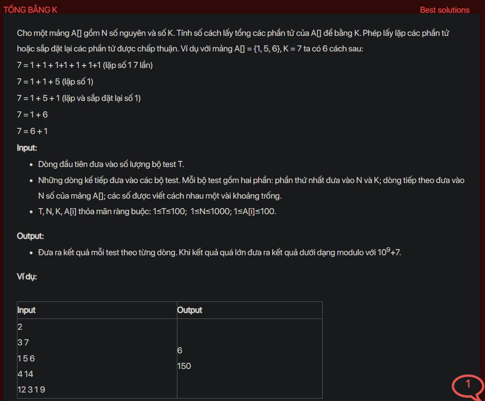

## dsa05024


## Approach
Problem Analysis:
The problem is asking to find the number of ways to pick elements from an array A[] such that their sum equals K. We can pick the same element multiple times and the order of picking does not matter.

Solution Analysis:
We can solve this problem using dynamic programming. The idea is to calculate the number of ways to get all sums from 0 to K using the elements of A[].

We use an array `dp` to store the number of ways. `dp[i]` is the number of ways to get the sum i. We initialize `dp[0]` to 1 because there is one way to get the sum 0, which is to pick no elements.

Then, for each element in A[], we update `dp` from i to K, where i is the element. For each i from element to K, `dp[i]` is the sum of `dp[i]` and `dp[i-element]`. This is because we can get the sum i either by not picking the element (which gives `dp[i]` ways) or by picking the element (which gives `dp[i-element]` ways).

Finally, `dp[K]` is the number of ways to get the sum K.

Implementation in C++:

```cpp
#include<bits/stdc++.h>
using namespace std;

int countWays(int A[], int N, int K) {
    int dp[K+1] = {0};
    dp[0] = 1;
    for (int i = 0; i < N; i++) {
        for (int j = A[i]; j <= K; j++) {
            dp[j] = (dp[j] + dp[j-A[i]]) % 1000000007;
        }
    }
    return dp[K];
}

int main() {
    int T;
    cin >> T;
    while (T--) {
        int N, K;
        cin >> N >> K;
        int A[N];
        for (int i = 0; i < N; i++) {
            cin >> A[i];
        }
        cout << countWays(A, N, K) << endl;
    }
    return 0;
}
```

Time Complexity Analysis:
The time complexity of the above solution is O(N*K) because we use two nested loops to calculate the number of ways. The space complexity is O(K) for the `dp` array.