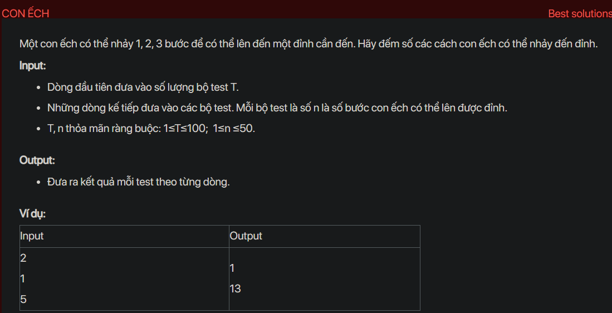

## dsa05025

## Approach
This problem can be solved using dynamic programming. The idea is to use a DP array where `dp[i]` will store the number of ways the frog can reach the `i-th` step using `1, 2, or 3` steps.

Here's the step-by-step plan:

1. Initialize a DP array of size `n+1` with all elements as 0. This is because initially, there are 0 ways to reach any step.

2. Set `dp[0]` as 1 because there is only one way to reach the 0th step (i.e., not moving at all).

3. Set `dp[1]` as 1 because there is only one way to reach the 1st step (i.e., taking one step).

4. Set `dp[2]` as 2 because there are two ways to reach the 2nd step (i.e., taking two steps of 1 or taking one step of 2).

5. Set `dp[3]` as 4 because there are four ways to reach the 3rd step (i.e., taking three steps of 1, taking one step of 1 and one step of 2, taking one step of 2 and one step of 1, or taking one step of 3).

6. For each step `i` from 4 to `n`, calculate `dp[i]` as the sum of `dp[i-1]`, `dp[i-2]`, and `dp[i-3]`. This is because the frog can reach the `i-th` step by jumping from the `(i-1)-th`, `(i-2)-th`, or `(i-3)-th` step.

7. The answer will be `dp[n]`, which represents the total number of ways the frog can reach the `n-th` step.

Here's the code that implements this plan:

```cpp
#include <iostream>
using namespace std;

int main() {
    int T;
    cin >> T;
    while (T--) {
        int n;
        cin >> n;
        long long dp[51] = {0};
        dp[0] = dp[1] = 1;
        dp[2] = 2;
        dp[3] = 4;
        for (int i = 4; i <= n; i++) {
            dp[i] = dp[i - 1] + dp[i - 2] + dp[i - 3];
        }
        cout << dp[n] << endl;
    }
    return 0;
}
```

This code reads the number of test cases and for each test case, it reads the number of steps and calculates the number of ways the frog can reach the top of the staircase. The result is printed for each test case.