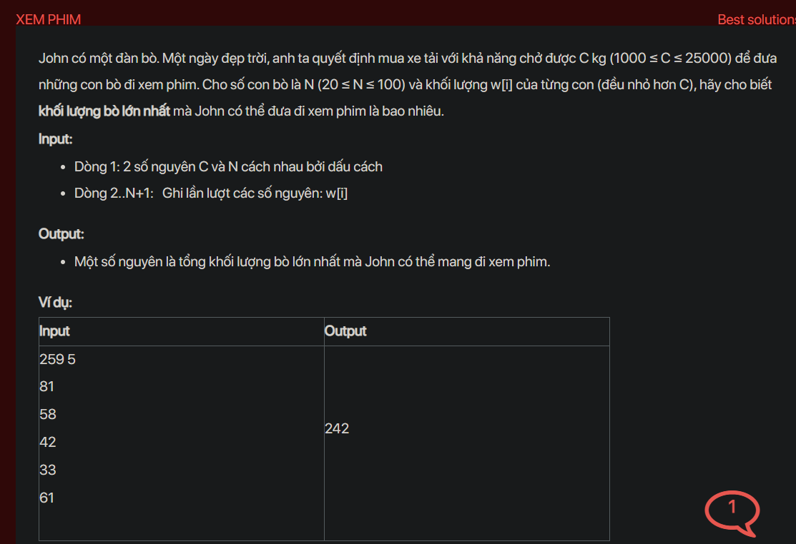

## dsa05026


## Approach
This problem can be solved using a dynamic programming approach known as the Knapsack problem. The idea is to find the maximum weight of cows that can be carried in the truck without exceeding the truck's capacity.

Here's the step-by-step plan:

1. Initialize a DP array of size `C+1` with all elements as 0. This is because initially, there are 0 cows in the truck.

2. For each cow `i` from 1 to `N`, iterate over all weights `j` from `C` down to `w[i]`. Update `dp[j]` as the maximum of `dp[j]` and `dp[j - w[i]] + w[i]`. This is because you can either choose to take the `i-th` cow or not. If you take the `i-th` cow, you add its weight to the total weight of the cows that you took before such that the total weight does not exceed `j`.

3. The answer will be `dp[C]`, which represents the maximum weight of cows that can be carried in the truck.

Here's the code that implements this plan:

```cpp
#include <iostream>
#include <algorithm>
using namespace std;

int main() {
    int C, N;
    cin >> C >> N;
    int w[N+1];
    for (int i = 1; i <= N; i++) {
        cin >> w[i];
    }
    int dp[C+1] = {0};
    for (int i = 1; i <= N; i++) {
        for (int j = C; j >= w[i]; j--) {
            dp[j] = max(dp[j], dp[j - w[i]] + w[i]);
        }
    }
    cout << dp[C] << endl;
    return 0;
}
```

This code reads the truck's capacity and the number of cows, and the weight of each cow. It then calculates the maximum weight of cows that can be carried in the truck and prints the result.

## Explain in detail
Sure, let's break it down:

This problem is a variation of the classic Knapsack problem. The Knapsack problem is a problem in combinatorial optimization: Given a set of items, each with a weight and a value, determine the number of each item to include in a collection so that the total weight is less than or equal to a given limit and the total value is as large as possible.

In this case, the "items" are the cows, the "weight" of each item is the weight of each cow, and the "value" of each item is also the weight of each cow (since we want to maximize the total weight of cows that can be carried in the truck). The "limit" is the capacity of the truck.

Here's a more detailed explanation of the steps:

1. **Initialize a DP array:** We create an array `dp` of size `C+1` and initialize all elements to 0. The `i-th` element of this array (`dp[i]`) will store the maximum weight of cows that can be carried in the truck if the truck's capacity is `i`. Initially, there are no cows in the truck, so the maximum weight is 0 for all capacities.

2. **Iterate over all cows:** For each cow `i` from 1 to `N`, we consider whether to take this cow or not.

3. **Update the DP array:** We iterate over all weights `j` from `C` down to `w[i]`. If `j` is less than `w[i]`, it means that the truck's capacity is less than the weight of the `i-th` cow, so we can't take this cow. If `j` is greater than or equal to `w[i]`, it means that the truck's capacity is enough to carry the `i-th` cow. In this case, we have two options: we can either take the `i-th` cow or not. If we take the `i-th` cow, the total weight of cows in the truck will be `dp[j - w[i]] + w[i]`. If we don't take the `i-th` cow, the total weight of cows in the truck will be `dp[j]`. We want to maximize the total weight of cows, so we choose the maximum of these two options.

4. **Find the maximum weight:** After considering all cows and all capacities, the maximum weight of cows that can be carried in the truck will be `dp[C]`.

The reason why we use dynamic programming in this problem is that the decision to take or not to take a cow depends on the decisions made for the previous cows and the remaining capacity of the truck. By storing the maximum weight for each capacity in the `dp` array, we avoid recalculating the same values multiple times, which makes the algorithm more efficient.