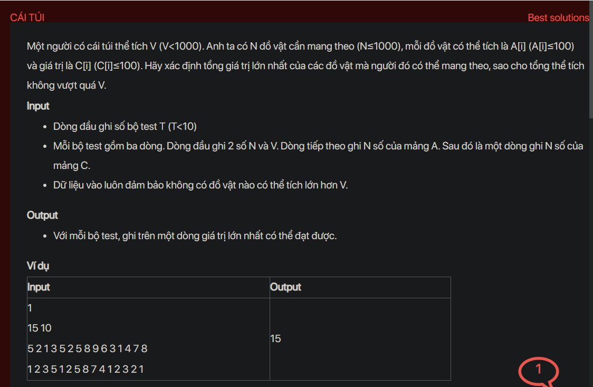

## dsa05027

## Approach
This problem is a classic 0/1 Knapsack problem which can be solved using dynamic programming. The idea is to find the maximum value of items that can be put in the bag without exceeding its volume.

Here's the step-by-step plan:

1. Initialize a DP array of size `V+1` with all elements as 0. This is because initially, the bag is empty and the total value of items in the bag is 0.

2. For each item `i` from 1 to `N`, iterate over all volumes `j` from `V` down to `A[i]`. Update `dp[j]` as the maximum of `dp[j]` and `dp[j - A[i]] + C[i]`. This is because you can either choose to take the `i-th` item or not. If you take the `i-th` item, you add its value to the total value of the items that you took before such that the total volume does not exceed `j`.

3. The answer will be `dp[V]`, which represents the maximum value of items that can be put in the bag.

Here's the code that implements this plan:

```cpp
#include <iostream>
#include <algorithm>
using namespace std;

int main() {
    int T;
    cin >> T;
    while (T--) {
        int N, V;
        cin >> N >> V;
        int A[N+1], C[N+1];
        for (int i = 1; i <= N; i++) {
            cin >> A[i];
        }
        for (int i = 1; i <= N; i++) {
            cin >> C[i];
        }
        int dp[V+1] = {0};
        for (int i = 1; i <= N; i++) {
            for (int j = V; j >= A[i]; j--) {
                dp[j] = max(dp[j], dp[j - A[i]] + C[i]);
            }
        }
        cout << dp[V] << endl;
    }
    return 0;
}
```

This code reads the number of test cases and for each test case, it reads the number of items, the volume of the bag, the volume of each item, and the value of each item. It then calculates the maximum value of items that can be put in the bag and prints the result for each test case.

## Explain
Sure, let's break it down:

This problem is a variation of the classic Knapsack problem. The Knapsack problem is a problem in combinatorial optimization: Given a set of items, each with a weight and a value, determine the number of each item to include in a collection so that the total weight is less than or equal to a given limit and the total value is as large as possible.

In this case, the "items" are the objects the person has, the "weight" of each item is the volume of each object, and the "value" of each item is the value of each object. The "limit" is the volume of the bag.

Here's a more detailed explanation of the steps:

1. **Initialize a DP array:** We create an array `dp` of size `V+1` and initialize all elements to 0. The `i-th` element of this array (`dp[i]`) will store the maximum value of items that can be put in the bag if the bag's volume is `i`. Initially, the bag is empty, so the maximum value is 0 for all volumes.

2. **Iterate over all items:** For each item `i` from 1 to `N`, we consider whether to put this item in the bag or not.

3. **Update the DP array:** We iterate over all volumes `j` from `V` down to `A[i]`. If `j` is less than `A[i]`, it means that the bag's volume is less than the volume of the `i-th` item, so we can't put this item in the bag. If `j` is greater than or equal to `A[i]`, it means that the bag's volume is enough to hold the `i-th` item. In this case, we have two options: we can either put the `i-th` item in the bag or not. If we put the `i-th` item in the bag, the total value of items in the bag will be `dp[j - A[i]] + C[i]`. If we don't put the `i-th` item in the bag, the total value of items in the bag will be `dp[j]`. We want to maximize the total value of items, so we choose the maximum of these two options.

4. **Find the maximum value:** After considering all items and all volumes, the maximum value of items that can be put in the bag will be `dp[V]`.

The reason why we use dynamic programming in this problem is that the decision to put or not to put an item in the bag depends on the decisions made for the previous items and the remaining volume of the bag. By storing the maximum value for each volume in the `dp` array, we avoid recalculating the same values multiple times, which makes the algorithm more efficient.