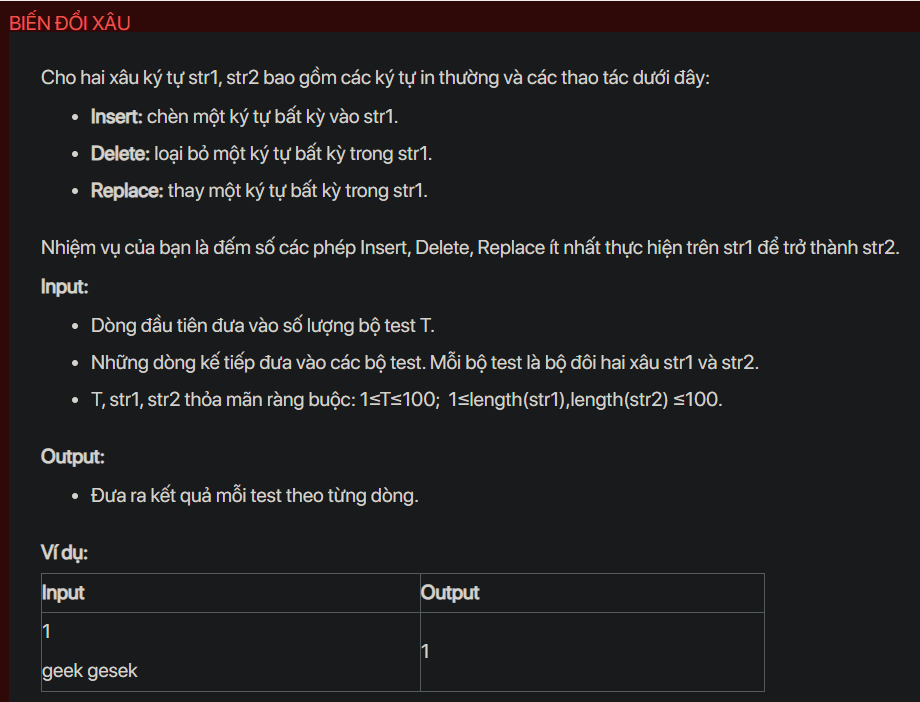

## dsa05028

## Approach
Problem Analysis:
The problem is asking to find the minimum number of operations (insert, delete, replace) required to transform one string into another. This is a classic problem known as the Edit Distance problem.

Solution Analysis:
We can solve this problem using dynamic programming. The idea is to calculate the minimum number of operations required to transform all prefixes of the first string into all prefixes of the second string.

We use a 2D array `dp` to store the solutions to the subproblems. `dp[i][j]` is the minimum number of operations required to transform the first i characters of the first string into the first j characters of the second string.

We initialize `dp[i][0]` to i and `dp[0][j]` to j for all valid i and j, because it takes i operations to transform the first i characters of the first string into an empty string and j operations to transform an empty string into the first j characters of the second string.

Then, for each character in the first string and for each character in the second string, if the characters are the same, `dp[i][j]` is `dp[i-1][j-1]`, because no operation is required. Otherwise, `dp[i][j]` is the minimum of `dp[i-1][j]`, `dp[i][j-1]`, and `dp[i-1][j-1]`, plus 1, because we can either delete the current character in the first string, insert the current character in the second string, or replace the current character in the first string with the current character in the second string.

Finally, `dp[n][m]` is the minimum number of operations required to transform the first string into the second string, where n and m are the lengths of the first string and the second string, respectively.

Implementation in C++:

```cpp
#include<bits/stdc++.h>
using namespace std;

int editDistance(string str1, string str2) {
    int n = str1.size();
    int m = str2.size();
    vector<vector<int>> dp(n+1, vector<int>(m+1));
    for (int i = 0; i <= n; i++) {
        for (int j = 0; j <= m; j++) {
            if (i == 0) {
                dp[i][j] = j;
            } else if (j == 0) {
                dp[i][j] = i;
            } else if (str1[i-1] == str2[j-1]) {
                dp[i][j] = dp[i-1][j-1];
            } else {
                dp[i][j] = min({dp[i-1][j], dp[i][j-1], dp[i-1][j-1]}) + 1;
            }
        }
    }
    return dp[n][m];
}

int main() {
    int T;
    cin >> T;
    while (T--) {
        string str1, str2;
        cin >> str1 >> str2;
        cout << editDistance(str1, str2) << endl;
    }
    return 0;
}
```

Time Complexity Analysis:
The time complexity of the above solution is O(n*m) because we use two nested loops to calculate the minimum number of operations. The space complexity is O(n*m) for the `dp` array.