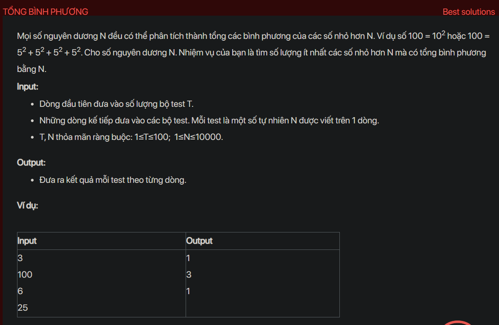

## dsa05031

## Approach
Problem Analysis:
The problem is asking to find the minimum number of perfect squares that sum up to a given number N. This is a classic problem known as the Perfect Squares problem.

Solution Analysis:
We can solve this problem using dynamic programming. The idea is to calculate the minimum number of perfect squares that sum up to all numbers from 0 to N.

We use an array `dp` to store the solutions to the subproblems. `dp[i]` is the minimum number of perfect squares that sum up to i. We initialize `dp[0]` to 0 because there are no perfect squares that sum up to 0.

Then, for each number from 1 to N, we calculate `dp[i]` as the minimum of `dp[i]` and `dp[i-j*j] + 1` for all j from 1 to sqrt(i), because we can either not use the perfect square j*j or use it.

Finally, `dp[N]` is the minimum number of perfect squares that sum up to N.

Implementation in C++:

```cpp
#include<bits/stdc++.h>
using namespace std;

int minSquares(int N) {
    vector<int> dp(N+1, INT_MAX);
    dp[0] = 0;
    for (int i = 1; i <= N; i++) {
        for (int j = 1; j*j <= i; j++) {
            dp[i] = min(dp[i], dp[i-j*j] + 1);
        }
    }
    return dp[N];
}

int main() {
    int T;
    cin >> T;
    while (T--) {
        int N;
        cin >> N;
        cout << minSquares(N) << endl;
    }
    return 0;
}
```

Time Complexity Analysis:
The time complexity of the above solution is O(N*sqrt(N)) because we use two nested loops to calculate the minimum number of perfect squares. The space complexity is O(N) for the `dp` array.