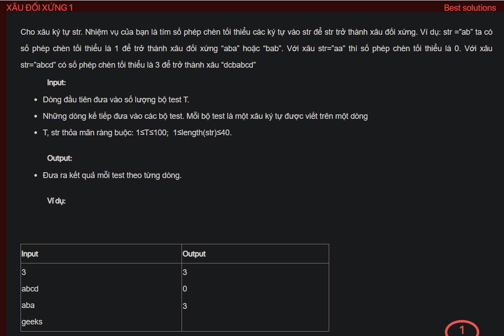

## dsa05032

## Approach
**Problem Analysis:**

The problem is to find the minimum number of insertions needed to make a string palindrome. A palindrome is a string that reads the same forward and backward.

**Solution Analysis:**

This problem can be solved using dynamic programming. The idea is to calculate the minimum number of insertions needed to make each substring a palindrome, and use these results to calculate the final result.

The algorithm to solve this problem can be described as follows:

1. Initialize a 2D array dp of size n by n to store the minimum number of insertions needed for each substring, where n is the length of the string. dp[i][j] is for the substring from i to j.
2. For each substring from length 1 to n, calculate dp[i][j] based on dp[i+1][j], dp[i][j-1], and dp[i+1][j-1].
3. The final result is dp[0][n-1].

**Implementation in C++:**

```cpp
#include <iostream>
#include <vector>
#include <string>
using namespace std;

int main() {
    int T;
    cin >> T;
    while (T--) {
        string str;
        cin >> str;
        int n = str.size();
        vector<vector<int>> dp(n, vector<int>(n));
        for (int len = 2; len <= n; len++) {
            for (int i = 0; i <= n - len; i++) {
                int j = i + len - 1;
                if (str[i] == str[j]) {
                    dp[i][j] = dp[i+1][j-1];
                } else {
                    dp[i][j] = min(dp[i+1][j], dp[i][j-1]) + 1;
                }
            }
        }
        cout << dp[0][n-1] << "\n";
    }
    return 0;
}
```

**Time Complexity Analysis:**

The time complexity of the algorithm is O(n^2), where n is the length of the string, because it iterates over all possible substrings of the string. This is efficient enough for the given problem constraints (1 ≤ length(str) ≤ 40).