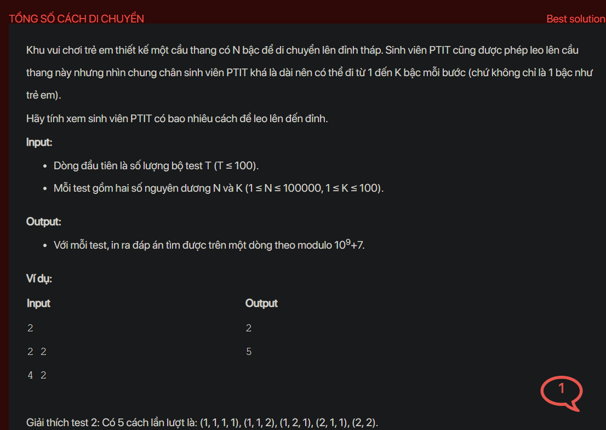

## dsa05034

## Approach
Absolutely, let's break it down:

This problem is about finding the number of ways to climb a staircase with `N` steps, where you can climb from 1 to `K` steps at a time.

The key to solving this problem is to realize that the number of ways to reach a step depends on the number of ways to reach the previous steps. This makes it a perfect candidate for dynamic programming, which is a technique for solving problems by breaking them down into smaller subproblems and reusing solutions to these subproblems to build solutions to larger problems.

Here's a more detailed explanation of the steps:

1. **Initialize a DP array:** We create an array `dp` of size `N+1` where `N` is the number of steps. The `i-th` element of this array (`dp[i]`) will store the number of ways to reach the `i-th` step. We initialize `dp[0]` to 1 because there is one way to reach the first step (do nothing).

2. **Iterate over the steps:** For each step `i` from 1 to `N`, we consider how this step can be reached.

3. **Update the DP array:** The `i-th` step can be reached from any of the previous `K` steps. So, we add up the number of ways to reach all these previous steps to get the number of ways to reach the `i-th` step. This is done by summing `dp[j]` for all `j` from `i-1` to `i-K` (if `j` is non-negative).

4. **Find the number of ways:** After considering all steps, the number of ways to reach the top of the stairs will be `dp[N]`.

The reason why we use dynamic programming in this problem is that the decision to climb a certain number of steps depends on the decisions made for the previous steps. By storing the number of ways to reach each step in the `dp` array, we avoid recalculating the same values multiple times, which makes the algorithm more efficient.