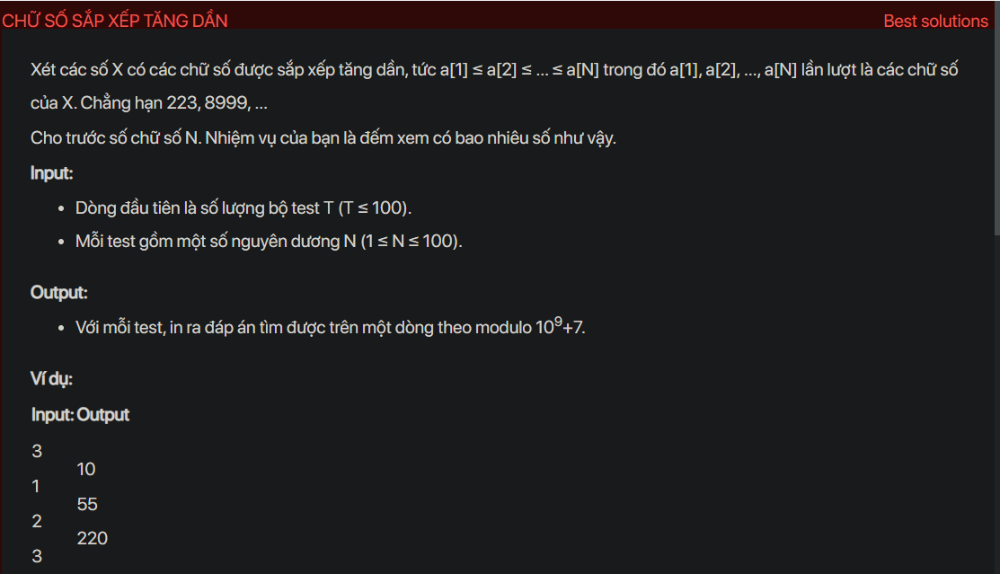

## dsa05035

## Approach
Problem Analysis:
The problem is asking to find the number of non-decreasing numbers of length N. A non-decreasing number is a number whose digits are in non-decreasing order from left to right.

Solution Analysis:
We can solve this problem using dynamic programming. The idea is to calculate the number of non-decreasing numbers of all lengths from 1 to N.

We use a 2D array `dp` to store the solutions to the subproblems. `dp[i][j]` is the number of non-decreasing numbers of length i ending with digit j. We initialize `dp[1][j]` to 1 for all valid j, because there is one non-decreasing number of length 1 ending with each digit.

Then, for each length from 2 to N and for each digit, we calculate `dp[i][j]` as the sum of `dp[i-1][k]` for all k from 0 to j, because a non-decreasing number of length i ending with digit j can be formed by appending digit j to a non-decreasing number of length i-1 ending with any digit from 0 to j.

Finally, the number of non-decreasing numbers of length N is the sum of `dp[N][j]` for all valid j.

Implementation in C++:

```cpp
#include<bits/stdc++.h>
using namespace std;

#define MOD 1000000007

int countNumbers(int N) {
    vector<vector<int>> dp(N+1, vector<int>(10));
    for (int j = 0; j <= 9; j++) {
        dp[1][j] = 1;
    }
    for (int i = 2; i <= N; i++) {
        for (int j = 0; j <= 9; j++) {
            for (int k = 0; k <= j; k++) {
                dp[i][j] = (dp[i][j] + dp[i-1][k]) % MOD;
            }
        }
    }
    int count = 0;
    for (int j = 0; j <= 9; j++) {
        count = (count + dp[N][j]) % MOD;
    }
    return count;
}

int main() {
    int T;
    cin >> T;
    while (T--) {
        int N;
        cin >> N;
        cout << countNumbers(N) << endl;
    }
    return 0;
}
```

Time Complexity Analysis:
The time complexity of the above solution is O(N) because we use three nested loops to calculate the number of non-decreasing numbers. The space complexity is O(N) for the `dp` array.