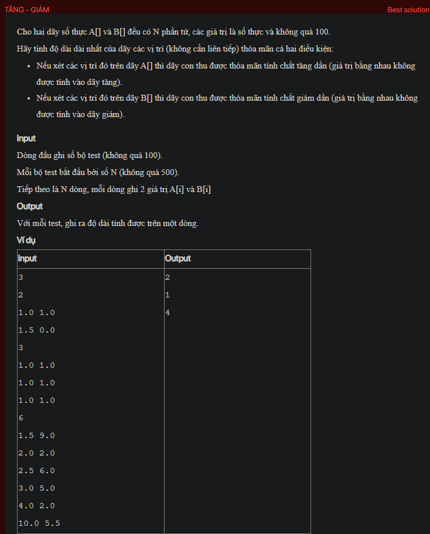

## dsa05036


## Approach
Problem Analysis:
The problem is asking to find the longest subsequence such that it is increasing in array A[] and decreasing in array B[].

Solution Analysis:
We can solve this problem using dynamic programming. The idea is to calculate the longest subsequence ending at each index that satisfies the given conditions.

We use two arrays `inc` and `dec` to store the solutions to the subproblems. `inc[i]` is the length of the longest subsequence ending at index i that is increasing in array A[] and `dec[i]` is the length of the longest subsequence ending at index i that is decreasing in array B[].

We initialize `inc[i]` and `dec[i]` to 1 for all valid i, because a subsequence of length 1 always satisfies the given conditions.

Then, for each index from 1 to N-1, we calculate `inc[i]` and `dec[i]` as follows:

- For all j from 0 to i-1, if A[i] > A[j] and B[i] < B[j], then `inc[i]` is the maximum of `inc[i]` and `inc[j] + 1` and `dec[i]` is the maximum of `dec[i]` and `dec[j] + 1`.

Finally, the length of the longest subsequence that satisfies the given conditions is the maximum of `inc[i]` and `dec[i]` for all valid i.

Implementation in C++:

```cpp
#include<bits/stdc++.h>
using namespace std;

int longestSubsequence(int N, vector<double>& A, vector<double>& B) {
    vector<int> inc(N, 1), dec(N, 1);
    for (int i = 1; i < N; i++) {
        for (int j = 0; j < i; j++) {
            if (A[i] > A[j] && B[i] < B[j]) {
                inc[i] = max(inc[i], inc[j] + 1);
                dec[i] = max(dec[i], dec[j] + 1);
            }
        }
    }
    return max(*max_element(inc.begin(), inc.end()), *max_element(dec.begin(), dec.end()));
}

int main() {
    int T;
    cin >> T;
    while (T--) {
        int N;
        cin >> N;
        vector<double> A(N), B(N);
        for (int i = 0; i < N; i++) {
            cin >> A[i] >> B[i];
        }
        cout << longestSubsequence(N, A, B) << endl;
    }
    return 0;
}
```

Time Complexity Analysis:
The time complexity of the above solution is O(N^2) because we use two nested loops to calculate the longest subsequence. The space complexity is O(N) for the `inc` and `dec` arrays.