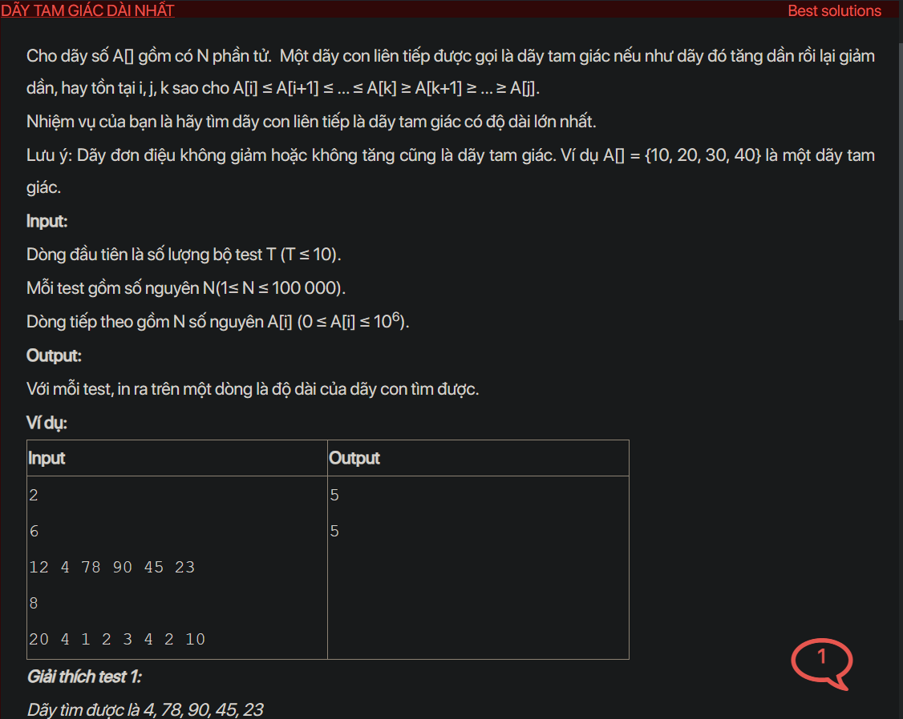

## dsa05040

## Approach
Problem Analysis:
The problem is asking to find the longest subarray that first increases and then decreases. This is also known as the longest bitonic subarray.

Solution Analysis:
We can solve this problem using dynamic programming. The idea is to calculate the longest increasing subarray ending at each index and the longest decreasing subarray starting at each index.

We use two arrays `inc` and `dec` to store the solutions to the subproblems. `inc[i]` is the length of the longest increasing subarray ending at index i and `dec[i]` is the length of the longest decreasing subarray starting at index i.

We initialize `inc[0]` and `dec[N-1]` to 1, because a subarray of length 1 always satisfies the given conditions.

Then, we calculate `inc[i]` and `dec[i]` as follows:

- For each index from 1 to N-1, if A[i] > A[i-1], then `inc[i]` is `inc[i-1] + 1`, otherwise `inc[i]` is 1.
- For each index from N-2 to 0, if A[i] > A[i+1], then `dec[i]` is `dec[i+1] + 1`, otherwise `dec[i]` is 1.

Finally, the length of the longest bitonic subarray is the maximum of `inc[i] + dec[i] - 1` for all valid i.

Implementation in C++:

```cpp
#include<bits/stdc++.h>
using namespace std;

int longestBitonicSubarray(int N, vector<int>& A) {
    vector<int> inc(N, 1), dec(N, 1);
    for (int i = 1; i < N; i++) {
        if (A[i] > A[i-1]) {
            inc[i] = inc[i-1] + 1;
        }
    }
    for (int i = N-2; i >= 0; i--) {
        if (A[i] > A[i+1]) {
            dec[i] = dec[i+1] + 1;
        }
    }
    int max_len = 0;
    for (int i = 0; i < N; i++) {
        max_len = max(max_len, inc[i] + dec[i] - 1);
    }
    return max_len;
}

int main() {
    int T;
    cin >> T;
    while (T--) {
        int N;
        cin >> N;
        vector<int> A(N);
        for (int i = 0; i < N; i++) {
            cin >> A[i];
        }
        cout << longestBitonicSubarray(N, A) << endl;
    }
    return 0;
}
```

Time Complexity Analysis:
The time complexity of the above solution is O(N) because we use two loops to calculate the longest bitonic subarray. The space complexity is O(N) for the `inc` and `dec` arrays.