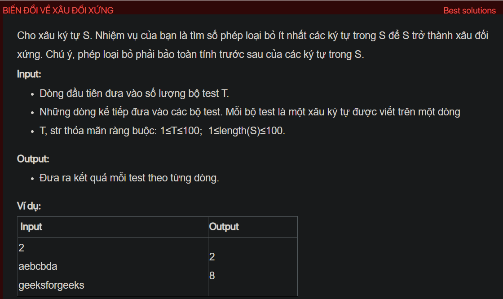

## dsa05041

## Approach
Problem Analysis:
The problem is asking to find the minimum number of deletions required to make a string palindrome. A palindrome is a string that reads the same forward and backward.

Solution Analysis:
We can solve this problem using dynamic programming. The idea is to find the length of the longest palindromic subsequence and subtract it from the length of the string.

A subsequence is a sequence that can be derived from another sequence by deleting some or no elements without changing the order of the remaining elements.

We use a 2D array `dp` to store the solutions to the subproblems. `dp[i][j]` is the length of the longest palindromic subsequence of the substring `s[i..j]`.

We initialize `dp[i][i]` to 1 for all valid i, because a single character is always a palindrome.

Then, we calculate `dp[i][j]` as follows:

- If `s[i]` is equal to `s[j]`, then `dp[i][j]` is `dp[i+1][j-1] + 2`.
- Otherwise, `dp[i][j]` is the maximum of `dp[i+1][j]` and `dp[i][j-1]`.

Finally, the minimum number of deletions required is the length of the string minus `dp[0][N-1]`.

Implementation in C++:

```cpp
#include<bits/stdc++.h>
using namespace std;

int minDeletionsToMakePalindrome(string s) {
    int N = s.size();
    vector<vector<int>> dp(N, vector<int>(N, 0));
    for (int i = 0; i < N; i++) {
        dp[i][i] = 1;
    }
    for (int len = 2; len <= N; len++) {
        for (int i = 0; i <= N - len; i++) {
            int j = i + len - 1;
            if (s[i] == s[j]) {
                dp[i][j] = dp[i+1][j-1] + 2;
            } else {
                dp[i][j] = max(dp[i+1][j], dp[i][j-1]);
            }
        }
    }
    return N - dp[0][N-1];
}

int main() {
    int T;
    cin >> T;
    while (T--) {
        string s;
        cin >> s;
        cout << minDeletionsToMakePalindrome(s) << endl;
    }
    return 0;
}
```

Time Complexity Analysis:
The time complexity of the above solution is O(N^2) because we use two nested loops to calculate the longest palindromic subsequence. The space complexity is O(N^2) for the `dp` array.