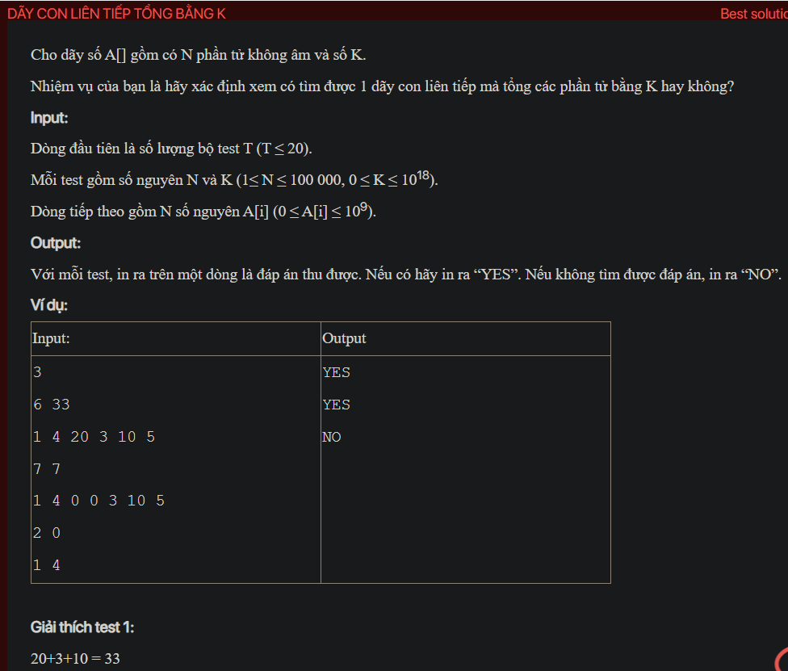

## dsa05042

## Approach
Problem Analysis:
The problem is asking to find if there is a contiguous subarray in the given array whose sum is equal to the given target sum K.

Solution Analysis:
We can solve this problem using a sliding window approach. The idea is to maintain a running sum and adjust the start and end of the window based on the comparison of the running sum and the target sum.

We initialize `start` to 0 and `sum` to the first element of the array.

Then, we iterate over the array starting from the second element. For each element, we do the following:

- While the running sum is greater than the target sum and `start` is less than the current index, we subtract the element at `start` from the running sum and increment `start`.
- If the running sum is equal to the target sum, we return "YES".
- Otherwise, we add the current element to the running sum.

If we have iterated over the entire array and haven't found a subarray with sum equal to the target sum, we return "NO".

Implementation in C++:

```cpp
#include<bits/stdc++.h>
using namespace std;

string isSubarraySum(int N, long long K, vector<long long>& A) {
    long long sum = A[0];
    int start = 0;
    for (int i = 1; i <= N; i++) {
        while (sum > K && start < i-1) {
            sum -= A[start];
            start++;
        }
        if (sum == K) {
            return "YES";
        }
        if (i < N) {
            sum += A[i];
        }
    }
    return "NO";
}

int main() {
    int T;
    cin >> T;
    while (T--) {
        int N;
        long long K;
        cin >> N >> K;
        vector<long long> A(N);
        for (int i = 0; i < N; i++) {
            cin >> A[i];
        }
        cout << isSubarraySum(N, K, A) << endl;
    }
    return 0;
}
```

Time Complexity Analysis:
The time complexity of the above solution is O(N) because we use a single loop to iterate over the array. The space complexity is O(1) as we are not using any extra space that scales with input size.