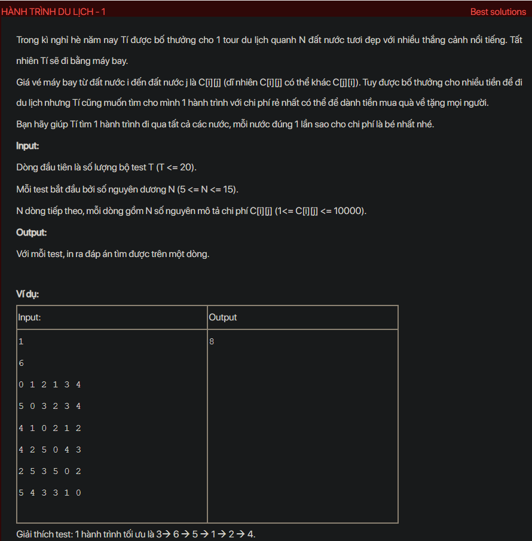

## dsap029

## Explain
Sure, let's break down the Traveling Salesman Problem (TSP) and the solution in your code.

**Problem:**
The TSP is a classic algorithmic problem in the field of computer science that focuses on optimization. In this problem, you have a list of cities and the distances between each pair of cities. The problem is to find the shortest possible route that goes to each city exactly once and returns to the original city.

**Solution:**
The solution in your code uses a technique called Dynamic Programming (DP) to solve the TSP. DP is essentially breaking down a problem into smaller subproblems, solving each subproblem, and storing the results of each subproblem to avoid solving the same subproblem multiple times.

**Bitmasking:**
Your solution uses a concept called "bitmasking". A bitmask is just an integer, but we think of it as an array of bits. The i-th bit is 1 if the i-th city has been visited, and 0 otherwise. For example, if we have 4 cities and the bitmask is 1011 (in binary), it means we have visited cities 0, 1, and 3, but not city 2.

**The `tsp` function:**
This function takes a city `i` and a bitmask `mask` of visited cities and returns the minimum cost of visiting each city exactly once starting from city `i`. The function works as follows:

1. If all cities have been visited (`mask == (1 << n) - 1`), it returns the cost of going back to the starting city, which is `dist[i][0]`.

2. If the cost has already been computed (`dp[i][mask] != -1`), it returns the precomputed value. This is the key idea of DP, which avoids redundant computations.

3. Otherwise, it tries to move to every other city `j` that has not been visited yet (`!(mask & (1 << j))`). It calculates the cost of moving to city `j` and solves the subproblem of visiting the remaining cities starting from city `j`. The minimum of these costs is stored in `dp[i][mask]`.

**The `testCase` function:**
This function reads the number of cities and the cost matrix. It initializes the `dp` array to -1. It then calculates the minimum cost to visit all cities starting from each city and prints the minimum of these costs.

**The `main` function:**
This function reads the number of test cases and calls the `testCase` function for each test case. It also contains code to redirect standard input and output to files, which is useful for testing and debugging.

I hope this helps! Let me know if you have any other questions.