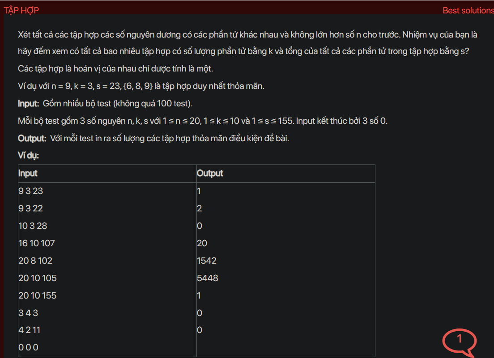

## dsa01014

## Approach
**Problem Analysis:**

Given a number n, consider all sets of distinct positive integers not greater than n. Your task is to count how many sets have k elements and the sum of all elements in the set is s.

**Solution Analysis:**

This problem can be solved using dynamic programming. The idea is to create a 3D DP table where dp[i][j][k] represents the number of sets of j elements from the first i numbers that sum up to k.

The algorithm to solve this problem can be described as follows:

1. Initialize a 3D DP table with all values as 0.

2. For each number from 1 to n, for each count from 1 to k, and for each sum from 1 to s, update dp[i][j][k] as the sum of dp[i-1][j][k] (not including the current number) and dp[i-1][j-1][k-i] (including the current number if k >= i).

3. The value of dp[n][k][s] after filling up the DP table is the answer.

**Implementation in C++:**

```cpp
#include <bits/stdc++.h>
using namespace std;

int main() {
    int n, k, s;
    while (cin >> n >> k >> s, n || k || s) {
        vector<vector<vector<int>>> dp(n+1, vector<vector<int>>(k+1, vector<int>(s+1, 0)));
        dp[0][0][0] = 1;
        for (int i = 1; i <= n; i++)
            for (int j = 0; j <= k; j++)
                for (int l = 0; l <= s; l++) {
                    dp[i][j][l] = dp[i-1][j][l];
                    if (j >= 1 && l >= i)
                        dp[i][j][l] += dp[i-1][j-1][l-i];
                }
        cout << dp[n][k][s] << endl;
    }
    return 0;
}
```

**Time Complexity Analysis:**

The time complexity of the algorithm is O(n * k * s), as we are filling up a 3D DP table of size n * k * s. The space complexity of the algorithm is also O(n * k * s), as we are using a 3D DP table of size n * k * s. This is efficient enough for the given problem constraints (1 ≤ n ≤ 20, 1 ≤ k ≤ 10 and 1 ≤ s ≤ 155).