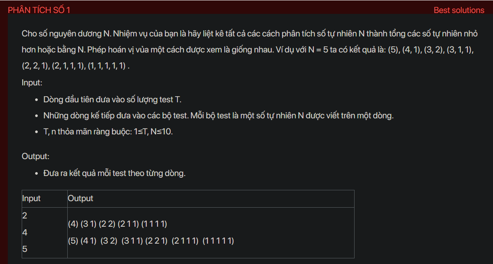

## dsa01016


## Approach
**Problem Analysis:**

The problem is asking to print all the possible combinations of numbers that sum up to a given number N. The numbers used in the combinations should be less than or equal to N. The order of numbers in the combinations does not matter.

**Solution Analysis:**

This problem can be solved using recursion and backtracking. The idea is to recursively subtract a number from N until it reaches 0. Each time we subtract a number, we add it to the current combination. If N becomes 0, we print the current combination.

**Implementation in C++:**

```cpp
#include<bits/stdc++.h>
using namespace std;

void printCombinations(vector<int>& combination) {
    for (int i = 0; i < combination.size(); i++) {
        if (i != combination.size() - 1)
            cout << combination[i] << ", ";
        else
            cout << combination[i];
    }
    cout << endl;
}

void findCombinations(int N, int maxNum, vector<int>& combination) {
    if (N == 0) {
        printCombinations(combination);
        return;
    }

    for (int i = min(N, maxNum); i >= 1; i--) {
        combination.push_back(i);
        findCombinations(N - i, i, combination);
        combination.pop_back();
    }
}

int main() {
    int T;
    cin >> T;
    while (T--) {
        int N;
        cin >> N;
        vector<int> combination;
        findCombinations(N, N, combination);
    }
    return 0;
}
```

**Time Complexity Analysis:**

The time complexity of the solution is O(N^N) because in the worst case, we are making N recursive calls for each number from 1 to N. This is exponential time complexity. However, since the constraints of the problem are small (N ≤ 10), this solution will run in a reasonable amount of time.