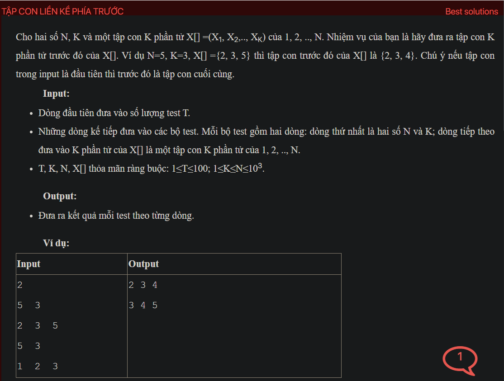

## dsa01018


```cpp
#include <bits/stdc++.h>
using namespace std;
void testCase();
int main() {
    // Write your code here
    #ifndef ONLINE_JUDGE
    freopen("input.txt", "r", stdin);
    freopen("output.txt", "w", stdout);
    #endif
    int t;
    cin  >> t;
    while (t--) {
        testCase();
        cout << endl;
    }
    return 0;
}
void testCase() {
    int n, k;
    cin >> n >> k;
    vector<int> a(k + 1);
    int countCheckFirst = 0;
    for (int i = 1; i <= k; i++) {
        cin >> a[i];
        if (a[i] == i) {
            countCheckFirst ++;
        }
    }
    if (countCheckFirst == k) {
        for (int i = 1; i <= k; i++) {
            cout << n - k + i << " ";
        }
        return;
    } else {
        int i = k;
        while (i >= 1 && a[i] == a[i - 1] + 1) {
            i--;
        }
        a[i]--;
        
        for (int j = i + 1; j <= k; j++) {
            a[j] = n - k + j;
        }
        for (int i = 1; i <= k; i++) {
            cout << a[i] << " ";
        }
    }
}
```