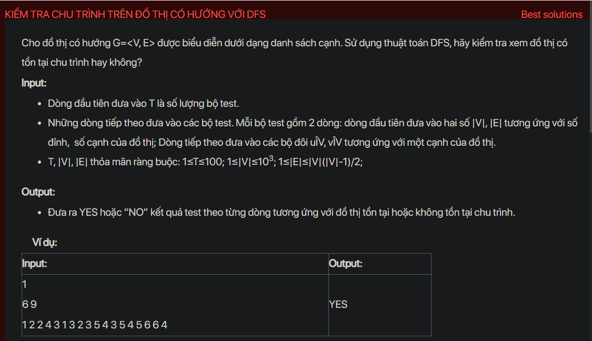

## dsa09016

## Approach
Problem Analysis:
The problem is about detecting a cycle in a directed graph. A cycle exists in a graph if there is a back edge present in the graph. A back edge is an edge that is joining a node to itself (self-loop) or one of its ancestors in the tree produced by DFS.

Solution Analysis:
We can use Depth-First Search (DFS) to detect a cycle in a Graph. DFS will start from every unvisited node. DFS calls itself recursively for every unvisited node. When recursive DFS call returns, if the returned value is true, then Graph contains a cycle, otherwise we continue to next unvisited node.

In more detail, the algorithm works as follows:
1. Create a recursive function that initializes the current index or vertex, visited array and recursion stack.
2. Mark the current node as visited and also mark the index in recursion stack.
3. For every adjacent vertex, if the vertex is not visited then recursively call the function for those vertices, If the recursive function returns true, return true. If the vertex is in the recursion stack then return true.
4. Create a wrapper function, that calls the recursive function for all the vertices, if it returns true return true. Else if for all vertices the function returns false return false.
5. Create a main function to read the graph into the adjacency list representation and calls the wrapper function, print the appropriate message based on the returned value from the function.

Implementation in C++:

```cpp
#include<bits/stdc++.h>
using namespace std;

bool isCyclicUtil(vector<int> adj[], int v, bool visited[], bool *recStack) {
    if(visited[v] == false) {
        visited[v] = true;
        recStack[v] = true;
        for(int i = 0; i < adj[v].size(); ++i) {
            if (!visited[adj[v][i]] && isCyclicUtil(adj, adj[v][i], visited, recStack))
                return true;
            else if (recStack[adj[v][i]])
                return true;
        }
    }
    recStack[v] = false;
    return false;
}

bool isCyclic(vector<int> adj[], int V) {
    bool *visited = new bool[V];
    bool *recStack = new bool[V];
    for(int i = 0; i < V; i++) {
        visited[i] = false;
        recStack[i] = false;
    }
    for(int i = 0; i < V; i++)
        if (isCyclicUtil(adj, i, visited, recStack))
            return true;
    return false;
}

int main() {
    int T;
    cin >> T;
    while (T--) {
        int V, E;
        cin >> V >> E;
        vector<int> adj[V];
        for (int i = 0; i < E; i++) {
            int u, v;
            cin >> u >> v;
            adj[u-1].push_back(v-1);
        }
        if (isCyclic(adj, V))
            cout << "YES" << endl;
        else
            cout << "NO" << endl;
    }
    return 0;
}
```

Time Complexity Analysis:
The time complexity of the solution is O(V+E) where V is the number of vertices and E is the number of edges in the graph. This is because we are using DFS traversal. The space complexity is O(V) for storing visited information.